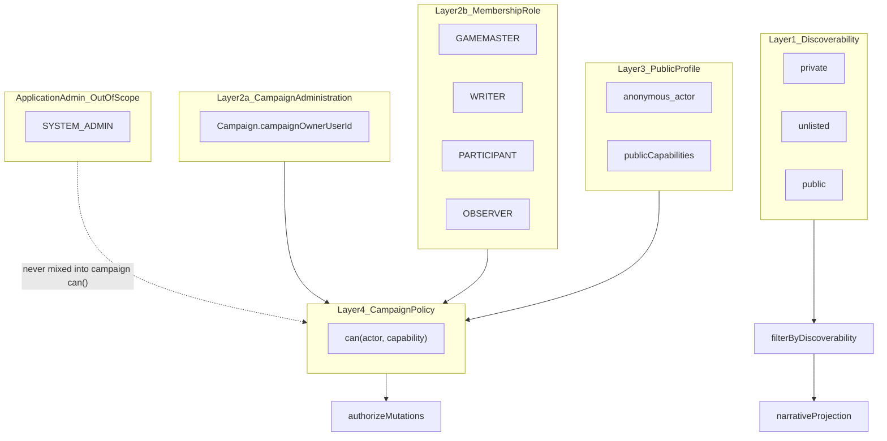

# Campaign access model

**Status:** Phase 1 implemented (2026-06)  
**Code:** [`shared/campaignPolicy/`](../../shared/campaignPolicy/)  
**Migration:** [`backend/prisma/migrations/20260604140000_campaign_access_framework/`](../../backend/prisma/migrations/20260604140000_campaign_access_framework/)  
**Related:** [narrative-projection-semantics.md](./narrative-projection-semantics.md) (read-path visibility; separate from write ACL), [capability-migration-audit.md](./capability-migration-audit.md) (Phase 2 migration plan)

---

## Purpose

Campaign authorization is split into **three authority layers** so platform control, container administration, and narrative collaboration do not collapse into a single “DM” concept. Write access is resolved through a centralized capability policy; read access for hidden lore continues through narrative projection and resource visibility tiers.

---

## Three authority layers

| Layer | Scope | Mechanism | Examples |
|-------|--------|-----------|----------|
| **Application administration** | Entire product | `User.role` = `SYSTEM_ADMIN` + [`systemAdmin`](../../backend/src/middleware/systemAdmin.ts) middleware | Moderation, system settings, cross-tenant ops |
| **Campaign administration** | One campaign container | `Campaign.campaignOwnerUserId` + `campaignAdminGrants` | Delete campaign, discoverability, membership governance, ownership transfer, billing (future) |
| **Narrative authority** | In-world / story collaboration | `CampaignMember.role` + `roleGrants` | World edit, revelation, chronology, elevated view |

### Terminology (use in code and docs)

| Avoid | Use instead |
|-------|-------------|
| `ownerUserId` | `campaignOwnerUserId` |
| “Platform ownership” | **Campaign administration** or **campaign ownership** |
| `isPlatformOwner` | `isCampaignOwner` |
| `ownershipGrants` | `campaignAdminGrants` |
| Membership role `owner` | Not a role — use `campaignOwnerUserId` |

> Campaign ownership is scoped strictly to an individual campaign container and is **not** related to global application administration.
>
> Campaign owners control: campaign deletion, discoverability, membership management, ownership transfer, and future billing/subscription controls.
>
> Application administrators remain a completely separate authority layer outside the campaign permission system.

Application admin checks **never** flow through `can(actor, …)` for campaign policy.

---

## Architecture



**Rules:**

- Membership role + campaign-owner flag **grant** capabilities (within campaign policy).
- Discoverability and per-resource visibility **filter** what is shown — they do not grant edit.
- Prefer `can(actor, capability)` in new code — not `if (role === 'DM')`.

---

## Schema (Phase 1)

| Model / field | Meaning |
|---------------|---------|
| `Campaign.campaignOwnerUserId` | Singular campaign administrator (FK → `User`, `onDelete: Restrict`) |
| `Campaign.discoverability` | `private` \| `unlisted` \| `public` (Phase 3) |
| `CampaignMember.role` | `GAMEMASTER` \| `WRITER` \| `PARTICIPANT` \| `OBSERVER` (stored as string) |
| `CampaignMember.chronologyContributor` | When true + `allowPlayerChronologyManagement`, participant may edit chronology (legacy Player parity) |

Legacy membership role strings were migrated in `20260604140000_campaign_access_framework`; runtime `legacyRoleMap` removed in Phase 3.

**Migration mapping:**

| Legacy `role` | New `role` | Notes |
|---------------|------------|--------|
| `DM` (all rows) | `GAMEMASTER` | Earliest DM sets `campaignOwnerUserId` |
| `Co-DM` | `WRITER` | |
| `Member`, `Player` | `PARTICIPANT` | `Player` → `chronologyContributor = true` |
| `Viewer` | `OBSERVER` | |

Multiple `GAMEMASTER` rows are allowed (multi-GM narrative teams). Administrative singularity is only `campaignOwnerUserId`.

---

## Membership roles

| Internal (`CampaignMember.role`) | UI label | Narrative tier |
|----------------------------------|----------|----------------|
| `GAMEMASTER` | Game Master | Elevated (with `WRITER`) |
| `WRITER` | Writer | Elevated |
| `PARTICIPANT` | Player | Party |
| `OBSERVER` | Observer | Party (read-only writes) |

Do **not** use internal name `party` for the membership tier (collides with `NarrativePerspective.party`).

Valid combined states:

| User | Campaign owner? | Membership role |
|------|-----------------|-----------------|
| Former admin, still in campaign | yes | `WRITER` |
| New narrative lead | no | `GAMEMASTER` |
| Creator who delegates story | yes | `WRITER` |
| Co-author | no | `GAMEMASTER` |

---

## Capability resolution

```ts
capabilities = roleCapabilities(membershipRole, memberFlags)
             ∪ campaignAdminCapabilities(userId === campaign.campaignOwnerUserId)
```

**Pre-ACL baseline:** policy vs enforcement matrix, open Participant decisions, and drift hotspots — [capability-inventory.md](./capability-inventory.md).

Entry points:

| Module | Role |
|--------|------|
| [`shared/campaignPolicy/policy.ts`](../../shared/campaignPolicy/policy.ts) | `buildCampaignActor`, `can`, `resolveActorCapabilities` |
| [`backend/src/lib/acl.ts`](../../backend/src/lib/acl.ts) | Backend wrappers + `CampaignAclContext` |
| [`backend/src/lib/campaignScopeContext.ts`](../../backend/src/lib/campaignScopeContext.ts) | Builds `CampaignContext` on each request |
| [`frontend/src/hooks/useCampaignPolicy.ts`](../../frontend/src/hooks/useCampaignPolicy.ts) | Client-side `can()` for UI gates |

### Campaign administration (`isCampaignOwner`)

| Capability | Notes |
|------------|--------|
| `campaign.delete` | |
| `campaign.transfer_ownership` | Updates `campaignOwnerUserId` only |
| `campaign.manage_roles` | Invite, kick, change membership roles |
| `campaign.visibility.edit` | Discoverability — **owner-only Phase 1** |
| `billing.manage` | Stub (Phase 2+) |

### Gamemaster (`GAMEMASTER`)

| Capability | Notes |
|------------|--------|
| `campaign.settings.edit` | Theme, sidebar, chronology flags — **not** discoverability |
| `world.edit`, `wiki.edit`, `assets.manage`, `templates.manage` | |
| `discovery.reveal`, `narrative.elevated_view`, `chronology.edit` | |
| `rumor.moderate`, `notes.moderate` | |

### Writer (`WRITER`)

Same operational/narrative writes as gamemaster **except** `campaign.settings.edit` and all campaign-admin capabilities.

### Participant / observer

- **Participant:** `campaign.view`, party wiki read, journal/character stubs; chronology edit only with `chronologyContributor` + campaign flag.
- **Observer:** read-only membership capabilities.
- **Anonymous:** `PUBLIC_ANONYMOUS_CAPABILITIES` when discoverability allows (`campaign.view`, `codex.view_public`).

---

## Discoverability (not a membership role)

Persisted on `Campaign.discoverability` (`private` | `unlisted` | `public`). Implementation: [`shared/campaignPolicy/discoverability.ts`](../../shared/campaignPolicy/discoverability.ts).

| Tier | Anonymous access | Global Hub listing |
|------|------------------|-------------------|
| `private` | No | No |
| `unlisted` | Yes | No |
| `public` | Yes | Yes |

Recruitment (`isLookingForGroup`) requires at least `public` discoverability.

---

## Transfers and leave

| Action | API | Affects | Does not affect |
|--------|-----|---------|-----------------|
| **Campaign ownership transfer** | `POST …/transfer-ownership/*` | `campaignOwnerUserId` | Membership roles |
| **Gamemaster handoff** | `POST …/transfer-gamemaster` | Target → `GAMEMASTER`; optional caller → `WRITER` | `campaignOwnerUserId` |
| **Leave campaign** | `DELETE …/members/me` | Membership row | Blocked if user is `campaignOwnerUserId` |

Ownership transfer no longer swaps DM/Co-DM roles on accept (pre-Phase 1 behavior).

Middleware:

| Gate | Capability / check |
|------|-------------------|
| `requireCampaignOwner` | `campaign.manage_roles` (campaign owner) |
| `requireGamemasterSettings` | `campaign.settings.edit` (gamemaster) |
| Domain middleware | `quest.edit`, `thread.edit`, `page.edit_any`, etc. (see route table in Phase 3) |

---

## Separation from narrative projection

| Concern | Module | Question answered |
|---------|--------|-------------------|
| **Write ACL** | `shared/campaignPolicy` | May this actor mutate campaign data? |
| **Read projection** | `shared/narrativeProjection` | What does this actor *see* after fog, tiers, and time? |

```ts
const visible = filterByResourceVisibility(actor, entries);
const editable = visible.filter((e) => can(actor, 'wiki.edit', e));
```

Elevated read view: `narrative.elevated_view` (gamemaster + writer) aligns with `isElevatedRole()` in narrative projection.

---

## Tests

- [`shared/campaignPolicy/policy.test.ts`](../../shared/campaignPolicy/policy.test.ts) — included in backend `npm test`
- Run: `node --import tsx --test shared/campaignPolicy/policy.test.ts`

---

## Phase 2 — ACL migration (shipped, A–E)

**Status:** Shipped (2026-06). Full audit: [capability-migration-audit.md](./capability-migration-audit.md). Checklist closed in [todo.md](../../todo.md).

Phases delivered: **A** Observer leak → **B0** ownership schema → **B1** registry splits → **B2** backend enforcement → **C** frontend affordances → **C+** visibility UX (initial rollout) → **D** role overrides → **E** legacy centralization (`legacyRoleMap` removal deferred until DB rows are clean).

Four separated concerns: campaign administration, authority (hidden capabilities), ownership (editorial), visibility (narrative presentation).

## Phase 3 — Discoverability + shim removal (shipped, 2026-06)

- `Campaign.discoverability` DB column; booleans removed
- Owner three-tier discoverability UI; hub lists `public` only
- `world.edit` / `requireOperationalManager` removed; routes use domain caps
- `legacyRoleMap` removed; deprecated grants dropped from `roleGrants`
- Read-path visibility uses `narrative.elevated_view` (not `page.edit_any`)

## Visibility presentation (Visibility System Phase 3)

Prerequisite: **Campaign access — Phase 3** (discoverability enum, read/write separation) — shipped.

**Shipped (2026-06):** [`shared/visibilityTier.ts`](../../shared/visibilityTier.ts) + `VisibilityTierChip`; maps hub (card/table/hierarchy), chronology feed + tech-tree timeline; convergence feed badges unified; legacy `VisibilityChip` removed.

**Remainder** in [todo.md](../../todo.md):

- Public campaign presentation controls (future) — per-campaign `publicCapabilities` beyond three-tier discoverability

## Campaign access follow-ons (deferred)

Billing, per-resource ACL, and custom roles are **not** part of the visibility presentation track — see [deferred-backlog.md](../deferred-backlog.md) (Campaign access).

Still open elsewhere in [todo.md](../../todo.md):

- **Campaign access — UI polish** — “Campaign owner” vs “Gamemaster” settings surfaces; optional `campaignAdminUserId` rename
- Gamemaster `campaign.visibility.edit` for collaborative publication (if needed)

---

## Applying migration on other environments

```bash
cd backend
npx prisma db execute --schema prisma/schema.prisma \
  --file prisma/migrations/20260604140000_campaign_access_framework/migration.sql
npx prisma migrate resolve --applied 20260604140000_campaign_access_framework
npx prisma generate
```
