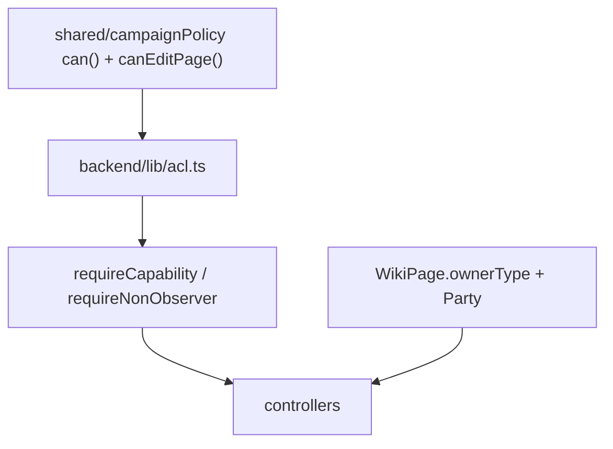

# Campaign Capability Inventory (Pre-ACL Baseline)

**Status:** Signed off for Phase 2 migration (2026-06)  
**Related:** [campaign-access-model.md](./campaign-access-model.md), [capability-migration-audit.md](./capability-migration-audit.md), [`shared/campaignPolicy/`](../../shared/campaignPolicy/)

---

## Purpose

Captures **policy** ([`roleGrants.ts`](../../shared/campaignPolicy/roleGrants.ts)) vs **enforcement** (routes/controllers) before and during ACL migration. Use when wiring `can(actor, capability)` and `canEditPage(actor, page)`.

**Legend**

| Symbol | Meaning |
|--------|---------|
| ✓ | Allowed |
| ✗ | Denied |
| ? | Conditional (flags, ownership, or campaign override) |
| ⚠ | Policy and enforcement disagree |

---

## Four layers (signed off)

| Layer | Question | User-facing? |
|-------|----------|:------------:|
| Campaign administration | Who manages the campaign container? | Owner settings only |
| Authority | Who can perform actions? | **Hidden** (capabilities) |
| Ownership | Who maintains this page? | Page settings; contextual when edit blocked |
| Visibility | Who can see this? | **Prominent** (indexes, headers, discovery) |

**Design principle:** Visibility is prominent, ownership is contextual. See [capability-migration-audit.md §3.6](./capability-migration-audit.md).

---

## Target page capabilities (replaces `wiki.edit`)

| Capability | Meaning |
|------------|---------|
| `page.create` | Create wiki pages |
| `page.edit_owned` | Edit `USER`-owned pages where `ownerUserId === actor` |
| `page.edit_party` | Edit `PARTY`-owned pages where `actor.partyId === ownerPartyId` |
| `page.edit_any` | Staff bypass — any page regardless of ownership |

**Ownership targets:** `STAFF` | `USER` | `PARTY` — chosen at create, not category-driven. `Party` entity (one default per campaign in B0).

| Role | `page.create` | `page.edit_owned` | `page.edit_party` | `page.edit_any` |
|------|:-------------:|:-----------------:|:-----------------:|:---------------:|
| GM | ✓ | ✓ | ✓ | ✓ |
| Writer | ✓ | ✓ | ✓ | ✓ |
| Participant | ✓ | ✓ | ✓ | ✗ |
| Observer | ✗ | ✗ | ✗ | ✗ |

---

## Narrative collaboration matrix (target)

| Capability | GM | Writer | Participant | Observer | Notes |
|------------|:--:|:------:|:-----------:|:--------:|-------|
| `page.create` | ✓ | ✓ | ✓ | ✗ | Replaces open `POST /wiki` membership gate |
| `page.edit_any` | ✓ | ✓ | ✗ | ✗ | Replaces `canManageNotebooks` for staff paths |
| `page.edit_owned` | ✓ | ✓ | ✓ | ✗ | USER-owned pages |
| `page.edit_party` | ✓ | ✓ | ✓ | ✗ | PARTY-owned pages (quest logs, session recaps) |
| `quest.edit` | ✓ | ✓ | ? | ✗ | Quest metadata; overrideable for party |
| `thread.edit` | ✓ | ✓ | ? | ✗ | Thread metadata |
| `chronology.edit` | ✓ | ✓ | ? | ✗ | Contributor flag + `allowPlayerChronologyManagement` |
| `rumor.moderate` | ✓ | ✓ | ✗ | ✗ | Spread/retract |
| `rumor.create` | — | — | — | ✗ | **Deferred** — keep GM-authored; no dedicated cap yet |
| `assets.upload` | ✓ | ✓ | ? | ✗ | Split from `assets.manage`; party via override |
| `assets.delete_owned` | ✓ | ✓ | ? | ✗ | Requires `Asset.uploadedByUserId` |
| `maps.edit` | ✓ | ✓ | ✗ | ✗ | Cartography — separate from generic upload |

Participant `?` rows: configurable via `CampaignRoleCapabilityOverride` (Phase D).

---

## Resolved decisions (formerly open)

| Topic | Decision |
|-------|----------|
| Party wiki write | **Ownership-based:** `page.create` + `page.edit_owned` / `page.edit_party`; not blanket `wiki.edit` |
| `chronology.edit` | Expose `chronologyContributor` in membership API; wire frontend `useCampaignPolicy` (Phase C) |
| `rumor.create` | **No cap** — rumors remain staff-moderated; players use wiki create with PARTY ownership if needed |
| `journal.create` | **Absorbed** into `page.create` + default `USER` ownership; layout still staff or owned-page edit |

---

## Legacy registry

Removed in Phase 3 (`world.edit`, `wiki.edit`, `assets.manage`, etc.). Historical matrix in git history; active grants in [`roleGrants.ts`](../../shared/campaignPolicy/roleGrants.ts).

---

## Enforcement architecture (target)



### Drift hotspots (migration status)

**Phases A–E + Phase 3 closed** (see [todo.md](../../todo.md)).

1. **Observer write leak** — **Resolved** (Phase A)
2. **`world.edit` shim** — **Removed** (Phase 3 route split)
3. **Read/write conflation on wiki lists** — **Resolved** (Phase 3: `hasElevatedView` for `wikiPageVisibilityFilter`)
4. **Frontend `isDMUser`** — **Bridged** (prop rename → UI polish / Campaign access UI polish)
5. **Visibility chips on all browse surfaces** — **Resolved** (Visibility System Phase 3 — maps hub, chronology feed/timeline; quest/threads/codex shipped in Phase C+)

---

## Tests

```bash
node --import tsx --test shared/campaignPolicy/policy.test.ts
```

Phase 2 (A–E) and Phase 3 are closed in [todo.md](../../todo.md). Follow-on: **Visibility System — Phase 3** (presentation); billing/ACL deferred in [deferred-backlog.md](../deferred-backlog.md).
