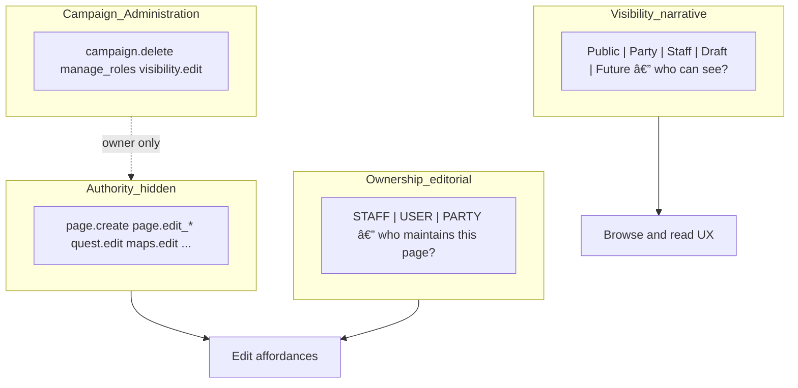
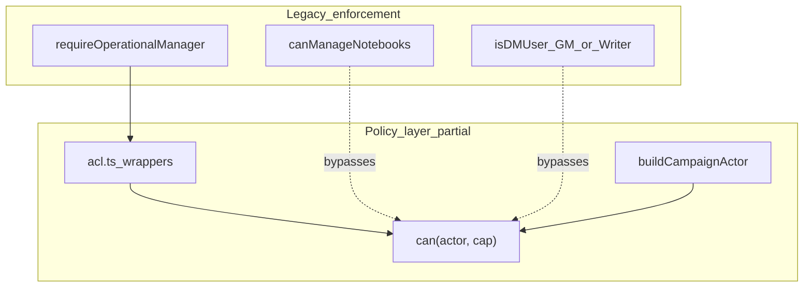
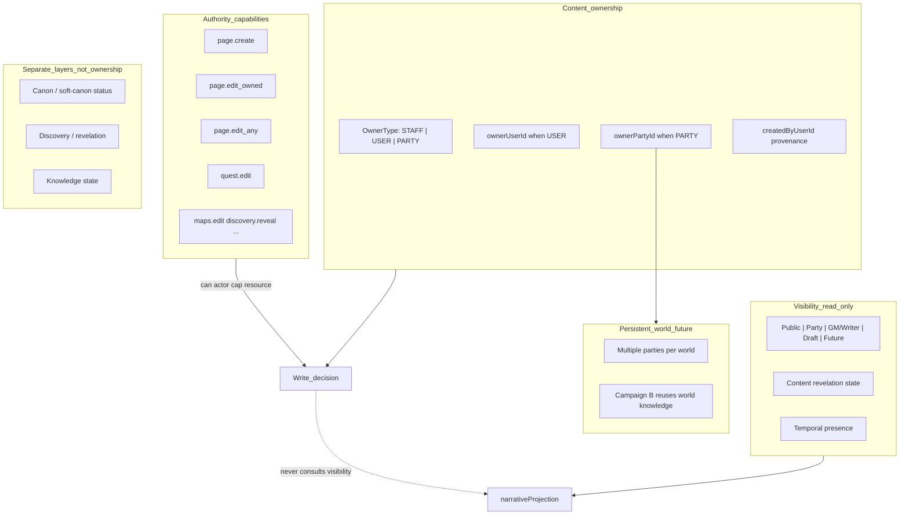
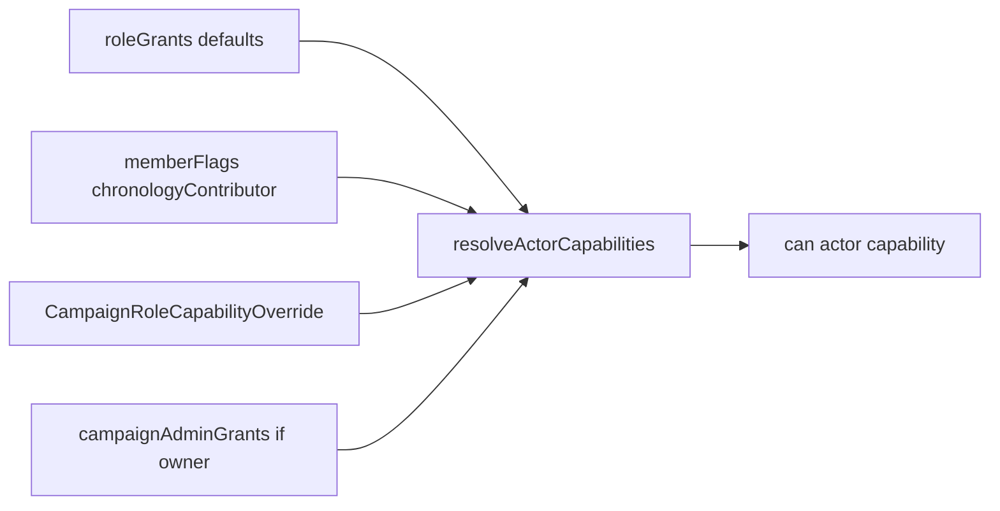
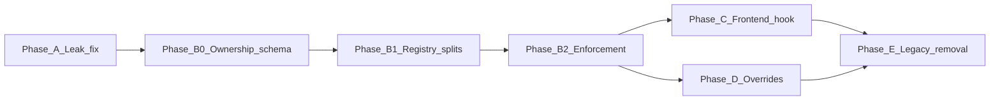

# Campaign Capability Migration — Architecture Audit

**Status:** Published audit (2026-06); implementation in progress  
**Baseline:** [capability-inventory.md](docs/architecture-internal/capability-inventory.md) (shipped)  
**Policy source:** [shared/campaignPolicy/](shared/campaignPolicy/)

---

## Executive summary

Esiana has a **correct Phase 1 capability framework** (`buildCampaignActor`, `can`, `roleGrants`, middleware wrappers in [acl.ts](backend/src/lib/acl.ts)) but **minimal adoption**: only **2 direct `can(actor, capability)` call sites** in backend application code. The application instead enforces authorization through **~15 parallel patterns** that all collapse to “GM or Writer� (legacy: “DM or Co-DM�).

| Layer | Migrated | Legacy |
|-------|----------|--------|
| Route middleware | `requireOperationalManager` → `WORLD_EDIT`; `requireChronologyManager` → `CHRONOLOGY_EDIT`; `requireCampaignOwner` → `CAMPAIGN_MANAGE_ROLES` | ~100 routes still alias `WORLD_EDIT` as “operational manager� |
| Controllers | `campaignsController` visibility; `requireGamemasterSettings` | `canManageNotebooks` in 8 controllers + 2 libs |
| Frontend | `useCampaignPolicy` hook exists | **0 consumers**; ~512 `isDMUser` refs across 109 files |

**Highest-risk drift:** Observer (and any member) can mutate wiki pages via routes that only require membership — documented in [capability-inventory.md](docs/architecture-internal/capability-inventory.md).

**Long-term target:** four separated layers (see below). Authority and campaign administration are hidden implementation; ownership is editorial; visibility is narrative presentation.

### Four layers (the architectural outcome)

This exercise began with DM-only metadata and ~721 `isDM` checks — one tangled concept. The target model separates:



| Layer | Question | User-facing? | Examples |
|-------|----------|:--------------:|----------|
| **Campaign administration** | Who manages the campaign container? | Owner settings only | Delete campaign, manage members, discoverability |
| **Authority** | Who can perform actions? | **No** — hidden | `page.edit_any`, `page.edit_party`, `quest.edit`, `maps.edit` |
| **Ownership** | Who maintains this content? | Page settings; contextual copy when edit blocked | Staff / Party / User |
| **Visibility** | Who can see this content? | **Prominent** — indexes, headers, discovery | Public, Party, Staff, Draft, Future |

**Orthogonal combinations become normal** — no special-case code paths:

| Visibility | Ownership | Meaning |
|------------|-----------|---------|
| Staff | Party | Party maintains a staff-visible planning doc |
| Party | User | Alice's personal note visible to the party |
| Party | Party | Shared quest log visible to party |
| Public | Staff | Published canon maintained by staff |

**Concept evolution (implementation order):** Roles → Capabilities → Ownership → Visibility → UX presentation.

---

## 1. Current Authorization Inventory

### 1.1 Pattern taxonomy

| Pattern | Approx. prevalence | Maps to capability | Primary locations |
|---------|-------------------|----------------------|-------------------|
| `isDMUser` (= GM \| Writer) | **~512 refs / 109 files** (frontend) | `wiki.edit` + `narrative.elevated_view` | [WikiPage.tsx](frontend/src/pages/WikiPage.tsx) (56), entity codex tree, hubs |
| `isDM` (thread filter param) | 8 refs / 4 files | N/A (filter semantics) | [ThreadHubView.tsx](frontend/src/components/thread/ThreadHubView.tsx) |
| `role === GAMEMASTER \|\| WRITER` | ~40 files, ~80 lines | Same as `isDMUser` | Maps, downtime, settings, dashboard |
| `canManageNotebooks(role)` | 10 backend files | `wiki.edit` / `world.edit` | [wikiController.ts](backend/src/controllers/wikiController.ts) and adventure/downtime/narrative controllers |
| `requireOperationalManager` | **~100 route bindings** | `WORLD_EDIT` | [campaignScoped.ts](backend/src/routes/campaignScoped.ts) |
| `requireChronologyManager` | ~15 routes | `CHRONOLOGY_EDIT` | campaignScoped chronology/calendar routes |
| `isElevatedMembershipRole` / `isElevatedWikiRole` | ~45 files | `narrative.elevated_view` | [narrativeProjection.ts](shared/narrativeProjection.ts), discovery, maps, rumor engine |
| `canViewWikiPage(visibility, role)` | ~45 files | `wiki.view_party` (partial) | Read/list filtering; not used on all write paths |
| `canModifySessionNote` | wikiController | **No registry primitive** | Author-self OR GM/Writer |
| `canContributeToLedger` / `canEditLedgerEntry` | ledger service | **No registry primitive** | Participant contribute; own-entry edit |
| `can(actor, capability)` direct | **2 call sites** | Registry | [campaignsController.ts](backend/src/controllers/campaignsController.ts) (`CAMPAIGN_VISIBILITY_EDIT`), [campaignScope.ts](backend/src/middleware/campaignScope.ts) (`CAMPAIGN_MANAGE_ROLES`) |
| `useCampaignPolicy()` | 1 definition, **0 imports** | Full registry | [useCampaignPolicy.ts](frontend/src/hooks/useCampaignPolicy.ts) |
| Legacy strings `DM` / `Co-DM` | Runtime via [legacyRoleMap.ts](shared/campaignPolicy/legacyRoleMap.ts) | Mapped at normalize | Still in tests and error messages |

**Note on “~721 isDM occurrences�:** A repo-wide grep including projection helpers, tests, and `isDM` as a **parameter name** (not just `isDMUser`) yields a higher count. The migration-relevant surface is **~512 `isDMUser` + ~80 inline GM\|Writer checks** in frontend source, plus backend `canManageNotebooks` / `requireOperationalManager`.



### 1.2 Subsystem inventory

#### Wiki

| Aspect | Detail |
|--------|--------|
| **Enforcement** | Route: `requireCampaignMember` (create/update/metadata), `requireOperationalManager` (layout/visibility/delete/lore/tags). Controller: `canManageNotebooks`, `canViewWikiPage`, `canModifySessionNote` |
| **Key files** | [wikiController.ts](backend/src/controllers/wikiController.ts), [campaignScoped.ts](backend/src/routes/campaignScoped.ts) L1040–1080, [wikiTree.ts](backend/src/lib/wikiTree.ts) |
| **Capability equivalent** | `wiki.edit`, `wiki.view_party`, `notes.moderate`, `discovery.reveal` |
| **Missing / drift** | `JOURNAL_CREATE`, `CHARACTER_EDIT` granted in policy but not enforced; Observer write leak on POST/PATCH wiki; `PATCH` has no read-before-write visibility check |
| **Frontend** | `isDMUser` prop tree from WikiPage; [wikiVisibility.ts](frontend/src/lib/wikiVisibility.ts) for read tiers |

#### Adventure

| Aspect | Detail |
|--------|--------|
| **Enforcement** | `canManageNotebooks` in [adventureHubController.ts](backend/src/controllers/adventureHubController.ts); storyboard PATCH has **no route middleware** |
| **Capability equivalent** | `world.edit`, `narrative.elevated_view` |
| **Missing** | `adventure.storyboard.edit` (informal); player preview is UI-only |
| **Frontend** | [AdventureWorkspaceContext.tsx](frontend/src/contexts/AdventureWorkspaceContext.tsx) `isDMUser`; StorySection, StoryboardSection |

#### Quest

| Aspect | Detail |
|--------|--------|
| **Enforcement** | Quest metadata patches in `updateWikiPageMetadata` require `canManage`; lifecycle via [narrativeLifecycleController.ts](backend/src/controllers/narrativeLifecycleController.ts); time pressure via `isElevatedWikiRole` |
| **Capability equivalent** | Subset of `wiki.edit`; lifecycle could use dedicated cap |
| **Missing** | `quest.edit`, `quest.lifecycle.transition` |
| **Frontend** | QuestHubView `isDMUser`; quest lifecycle display uses elevation for DM rewards |

#### Thread

| Aspect | Detail |
|--------|--------|
| **Enforcement** | Same as quest — metadata patches gated in wikiController |
| **Capability equivalent** | Subset of `wiki.edit` |
| **Missing** | `thread.edit` |
| **Frontend** | ThreadHubView; separate `isDM` filter param (naming collision risk) |

#### Rumor

| Aspect | Detail |
|--------|--------|
| **Enforcement** | Read: [rumorEngineService.ts](backend/src/lib/rumorEngineService.ts) filters by `isElevatedWikiRole`. Write: `POST /rumors/spread|retract` → `requireOperationalManager` |
| **Capability equivalent** | `rumor.moderate` (unused via `can()`) |
| **Missing** | `rumor.create`; no dedicated player submission flow |

#### Chronology

| Aspect | Detail |
|--------|--------|
| **Enforcement** | `requireChronologyManager` on events; `requireOperationalManager` on calendar CRUD/time advance; [chronologyController.ts](backend/src/controllers/chronologyController.ts) uses `canManageChronology` for read filters |
| **Capability equivalent** | `chronology.edit` |
| **Missing / drift** | `chronologyContributor` in DB but no API to set; frontend never passes contributor flag |
| **Frontend** | [chronologyPermissions.ts](frontend/src/lib/chronologyPermissions.ts) — correct shape, incomplete wiring |

#### Session Notes

| Aspect | Detail |
|--------|--------|
| **Enforcement** | Create: `requireCampaignMember`. Edit/delete: `canModifySessionNote` (author OR GM/Writer). Bulk delete: `requireOperationalManager` + `canManageNotebooks`. Notebooks: controller-only `canManageNotebooks` |
| **Capability equivalent** | `notes.moderate` (partial); no `sessionnote.create` / `sessionnote.edit_own` |
| **Frontend** | Hybrid: `canManageRole` + API `data.canManage` in [SessionNotesView.tsx](frontend/src/pages/SessionNotesView.tsx) — best partial migration example |

#### Assets

| Aspect | Detail |
|--------|--------|
| **Enforcement** | Upload/delete: `requireOperationalManager`. Stream: [assetAccess.ts](backend/src/lib/assetAccess.ts) — visibility + full-res downgrade via `canManageOperationalResources` |
| **Capability equivalent** | `assets.upload`, `assets.delete_any`, `assets.view` (split from `assets.manage`) |
| **Missing** | `assets.delete_owned`; `Asset.uploadedByUserId`; visibility-filtered `listCampaignAssets` |
| **Exception** | Session doc upload: any member |

#### Characters

| Aspect | Detail |
|--------|--------|
| **Enforcement** | Hub read: discovery + visibility projection. Metadata patch: `canManageNotebooks` only (blocks participants despite `character.edit` grant) |
| **Capability equivalent** | `character.edit` (policy only) |
| **Missing** | Own-character / linked-identity edit path |

#### Maps

| Aspect | Detail |
|--------|--------|
| **Enforcement** | All mutations: `requireOperationalManager`. Read: [mapPinVisibility.ts](backend/src/lib/mapPinVisibility.ts), [mapAssetVisibility.ts](backend/src/lib/mapAssetVisibility.ts) |
| **Capability equivalent** | `world.edit` / `assets.manage` (informal); `discovery.reveal` on reveal routes |
| **Missing** | `maps.edit`, `maps.pin.edit` |
| **Frontend** | Role-derived `canManage`/`canEdit` from fetchCampaign — not API flags |

#### Templates

| Aspect | Detail |
|--------|--------|
| **Enforcement** | `TEMPLATES_MANAGE` in registry; **no campaign route enforcement** (Template Studio removed) |
| **Capability equivalent** | Orphan capability — deprecate or reserve for plugin era |

#### Campaign Administration

| Aspect | Detail |
|--------|--------|
| **Enforcement** | Owner: `requireCampaignOwner` → `CAMPAIGN_MANAGE_ROLES`. Settings: `canModifyCampaign` → `CAMPAIGN_SETTINGS_EDIT`. Visibility: `can(actor, CAMPAIGN_VISIBILITY_EDIT)`. GM transfer: hardcoded `role === GAMEMASTER` |
| **Capability equivalent** | `campaignAdminGrants` — best-migrated area |
| **Missing** | `campaign.transfer_gamemaster` (informal) |
| **Frontend** | [CampaignSettingsPage.tsx](frontend/src/pages/CampaignSettingsPage.tsx) mixes owner vs GM checks correctly at UI level |

#### Discovery

| Aspect | Detail |
|--------|--------|
| **Enforcement** | [discoveryProjectionService.ts](backend/src/lib/discoveryProjectionService.ts) uses `canManage` (= GM\|Writer) for revelation viewer context; bulk reveal routes use `requireOperationalManager` |
| **Capability equivalent** | `discovery.reveal`, `narrative.elevated_view` |
| **Drift** | Revelation read context tied to edit elevation, not `can(actor, DISCOVERY_REVEAL)` |

#### Narrative systems

| Aspect | Detail |
|--------|--------|
| **Enforcement** | [narrativeProjection.ts](shared/narrativeProjection.ts) `buildNarrativeViewerCapabilities`; lifecycle/publish/branch controllers use `canManageNotebooks` |
| **Capability equivalent** | `narrative.elevated_view`, informal lifecycle caps |
| **Missing** | `narrative.lifecycle.edit`, `narrative.publish` |

#### Downtime (adjacent)

| Aspect | Detail |
|--------|--------|
| **Enforcement** | Haven/project: `canManageNotebooks`. Ledger: role-specific helpers in [campaignLedgerService.ts](backend/src/lib/campaignLedgerService.ts) |
| **Capability equivalent** | Subset of `world.edit` |
| **Missing** | `downtime.manage`, `ledger.contribute`, `ledger.edit_own` |

---

## 2. Capability Registry Review

### 2.1 Current registry ([capabilities.ts](shared/campaignPolicy/capabilities.ts))

22 capabilities across admin, operational, narrative, and party tiers.

### 2.2 Unused capabilities (defined, not enforced via `can()`)

| Capability | Intended use | Actually enforced as |
|------------|--------------|----------------------|
| `wiki.edit` | Wiki mutation | `canManageNotebooks` / `WORLD_EDIT` alias |
| `assets.manage` | Asset upload/delete | `requireOperationalManager` — **split** → `assets.upload`, `assets.delete_any`, `assets.delete_owned` |
| `templates.manage` | Template admin | Nothing (feature removed) |
| `discovery.reveal` | Fog/revelation | `requireOperationalManager` |
| `narrative.elevated_view` | GM view / ghost mode | `isElevatedMembershipRole` |
| `rumor.moderate` | Spread/retract | `requireOperationalManager` |
| `notes.moderate` | Session note moderation | `canManageNotebooks` |
| `wiki.view_party` | Party wiki read | `canViewWikiPage` custom tiers |
| `journal.create` | Player journals | `requireCampaignMember` on generic wiki create |
| `character.edit` | Player character edit | `canManageNotebooks` (stricter) |
| `codex.view_public` | Anonymous codex | Not referenced in backend src |

### 2.3 Enforced in code but missing from registry

| Informal permission | Current check | Recommended capability |
|--------------------|---------------|------------------------|
| Session note author edit | `canModifySessionNote` | `page.edit_owned` + `OwnerType.USER` |
| Session note / timeline create | `requireCampaignMember` | `page.create` + default `USER` ownership |
| Ledger contribute | `canContributeToLedger` | `ledger.contribute` |
| Ledger edit own entry | `canEditLedgerEntry` | `ledger.edit_own` |
| Gamemaster handoff | `role === GAMEMASTER` | `campaign.transfer_gamemaster` |
| Map pin / scene mutation | `requireOperationalManager` | `maps.edit` |
| Asset upload / delete | `requireOperationalManager` | `assets.upload`, `assets.delete_any` |
| Storyboard layout | `canManageNotebooks` | `adventure.storyboard.edit` |
| Quest/thread metadata | `canManageNotebooks` | `quest.edit`, `thread.edit` (or scoped metadata caps) |
| Rumor player submission | None | `rumor.create` (if product confirms) |
| Asset list / stream read | Visibility helpers | `assets.view` |
| Join request moderation | `requireOperationalManager` | `campaign.manage_join_requests` or reuse `campaign.manage_roles` |

### 2.4 Overly broad capabilities

**`world.edit` is the primary overload.** `requireOperationalManager` gates ~100 routes spanning wiki delete, maps, rumors, downtime settings, lore claims, join requests, narrative lifecycle, and more. During migration it works as a **compatibility shim**, but it cannot support per-campaign customization (e.g. “party can edit journals but not maps�).

**`wiki.edit` is the wrong capability boundary.** It conflates “party can contribute to worldbuilding� with “party can edit every wiki page.� Those are not the same thing. The correct model separates **authority** (role grants), **content ownership** (per-page), and **visibility** (read projection).

### 2.5 Target capability model (replaces `wiki.edit`)

**Core page capabilities (generic — ownership resolves *which* pages):**

| Capability | Meaning |
|------------|---------|
| `page.create` | Create new wiki pages (workspace/type gated by policy) |
| `page.edit_owned` | Edit `USER`-owned pages where `ownerUserId === actor` |
| `page.edit_party` | Edit `PARTY`-owned pages where `actor.partyId === ownerPartyId` |
| `page.edit_any` | Edit any page regardless of ownership (staff authority) |

**Default role matrix:**

| Role | `page.create` | `page.edit_owned` | `page.edit_party` | `page.edit_any` |
|------|:-------------:|:-----------------:|:-----------------:|:---------------:|
| GM | ✓ | ✓ | ✓ | ✓ |
| Writer | ✓ | ✓ | ✓ | ✓ |
| Party | ✓ | ✓ | ✓ | ✗ |
| Observer | ✗ | ✗ | ✗ | ✗ |

Splitting `page.edit_party` from `page.edit_owned` enables campaign overrides like "party may edit shared quest logs (`page.edit_party`) but not each other's personal journals (`page.edit_owned`)" — a natural collaborative configuration.

**Domain capabilities (type-specific — not ownership-exploded):**

| Capability | Scope |
|------------|-------|
| `quest.edit` | Quest metadata, status, lifecycle |
| `thread.edit` | Thread metadata, status |
| `chronology.edit` | Calendar/events (contributor flag for party) |
| `maps.edit` | Map scene assets, pins, layers (cartography) |
| `assets.upload` | Upload non-map campaign assets (images, session docs) |
| `assets.delete_any` | Delete any asset (staff) |
| `assets.delete_owned` | Delete assets you uploaded (party; requires authorship on `Asset`) |
| `downtime.manage` | Haven/project settings |
| `discovery.reveal` | Revelation mutations |
| `narrative.elevated_view` | Elevated read / ghost mode |
| `rumor.moderate` | Spread/retract |
| `ledger.contribute` | Treasury entries |

**Avoid per-type ownership capabilities** (`character.edit_own`, `journal.edit_own`, etc.) — they explode the override matrix. `page.edit_owned` + authorship ownership is the generic rule; workspace/type gates what may be **created**, not who owns it.

**Deprecate:** `wiki.edit`, `journal.create`, `character.edit`, `sessionnote.create`, `sessionnote.edit_own`, `assets.manage` → replaced by granular caps below. Keep `notes.moderate` for staff bulk session moderation.

### 2.6 Asset capability split (strongest split in audit)

`assets.manage` is too broad — it bundles upload, delete-any, and (implicitly) map full-res access. Split in **B1** before campaign overrides.

**Minimum split (ship in B1):**

| Capability | Route / behavior | Default grant |
|------------|------------------|---------------|
| `assets.upload` | `POST /uploads`, `POST /wiki-pages/upload` | GM/Writer; party optionally via override |
| `assets.delete_any` | `DELETE /uploads/:assetId` | GM/Writer only |
| `assets.view` | Stream/list; visibility-filtered | Members + discoverability rules |

**Owned split (B1 if `Asset.uploadedByUserId` added in B0; else B2):**

| Capability | Behavior | Parallels |
|------------|----------|-----------|
| `assets.delete_owned` | Delete asset where `uploadedByUserId === actor` | `page.edit_owned` |
| `assets.edit_owned` | Update metadata on own upload (credit, display name) — optional | Only if asset metadata edit UI exists |

**Staff supersedes** — same pattern as pages: `assets.delete_any` bypasses ownership; no transfer workflow.

**Maps stay separate:** `maps.edit` governs map **scene** assets (cartography pipeline, pins, layers). Generic `assets.upload` covers featured images, inline uploads, session document attachments. Avoid folding map upload into `assets.manage`.

**Current schema gap:** [`Asset`](backend/prisma/schema.prisma) has no `uploadedByUserId` today — add in B0 alongside page authorship (creation establishes ownership). Until then, enforce `assets.upload` + `assets.delete_any` only; defer `assets.delete_owned`.

**Override example:** Party gets `assets.upload` ✓, `assets.delete_owned` ✓, `maps.edit` ✗ — can attach session docs and remove their own uploads, cannot delete map assets.

**Phase B1 registry additions (before overrides):**

```
page.create, page.edit_owned, page.edit_party, page.edit_any   � replace wiki.edit
quest.edit, thread.edit
maps.edit, downtime.manage
assets.upload, assets.delete_any, assets.view
assets.delete_owned                           � when Asset.uploadedByUserId ships
ledger.contribute
page.visibility.edit
adventure.storyboard.edit
```

`world.edit` remains a **shim only** during B2 route migration.

**Example party override (collaborative contributors):**

| Capability | Party |
|------------|:-----:|
| `page.create` | ✓ |
| `page.edit_owned` | ✓ |
| `page.edit_party` | ✓ |
| `page.edit_any` | ✗ |
| `quest.edit` | ✓ |
| `thread.edit` | ✓ |
| `maps.edit` | ✗ |
| `assets.upload` | ✓ (session docs, inline images) |
| `assets.delete_owned` | ✓ |
| `assets.delete_any` | ✗ |
| `downtime.manage` | ✗ |
| `adventure.storyboard.edit` | ✗ |

Party documents, theorizes, and records history — on **USER**-owned personal pages and **PARTY**-owned collective pages, not staff canon (unless granted `page.edit_any`).

---

## 3. Authority, Content Ownership, and Visibility

Esiana needs **three independent concepts**. They must not be conflated.

| Concept | Question answered | Mechanism |
|---------|-------------------|-----------|
| **Authority** | Who *may* perform edit actions? | Capabilities (`page.edit_any`, `page.edit_owned`, `page.edit_party`, domain caps) — **hidden from users** |
| **Ownership** | Who *maintains* this knowledge record? | `OwnerType` + `ownerUserId` / `ownerPartyId` (stewardship entity, not setting canon) |
| **Visibility** | Who *sees* it? | Read projection only |

**Key insight:** Ownership ≠ authority. Staff always has authority via `page.edit_any`. Ownership means **who maintains this knowledge record** — not who owns the concept in-world.

**Why three owner types (not USER-only):** USER ownership has a **lifecycle problem** in the persistent-world future. Alice's `USER`-owned "Theories About The Red King" becomes orphaned when Campaign A ends and Campaign B reuses the same world two years later. **PARTY** ownership (`ownerPartyId = The Heroes of Ashfall`) survives campaigns as historical collective knowledge — aligned with party knowledge, quest state, session history, reputation, and discovery as **collective** systems.

Esiana's model:

```text
Knowledge has an author (provenance).
Knowledge has a steward (ownership: STAFF | USER | PARTY).
Knowledge has a perspective.
Knowledge may later become canon.
```

`createdByUserId` always records who created the page; `ownerType` + owner refs record **who stewards it** — chosen intentionally at creation.



### 3.1 Authority — who may edit?

| Capability | Meaning |
|------------|---------|
| `page.edit_any` | GM/Writer — edit **everything**, ownership irrelevant |
| `page.edit_owned` | Edit **USER**-owned pages you authored |
| `page.edit_party` | Edit **PARTY**-owned pages for your party |

Staff authority **supersedes** ownership. No ownership transfer workflow required — a GM can always edit Alice's Silver Company page; Alice remains steward for attribution, "My pages", and party edit rights.

### 3.2 Content ownership — three targets, chosen at creation

**Not** a single authorship rule. Creator role + **content intent** (workspace, create flow, or explicit picker) determine `ownerType`. `createdByUserId` always set for provenance.

| OwnerType | Steward | Typical content |
|-----------|---------|-----------------|
| **STAFF** | Campaign narrative staff | World locations (GM-maintained), canon timeline events, staff org records |
| **USER** | Individual member | Personal journals, character notes, personal theories, research notes |
| **PARTY** | Party entity (collective) | Quest logs, campaign journal, party theory board, session recaps, shared discoveries, travel records |

**Default-on-create heuristics** (UI may offer explicit picker):

| Creator | Suggested default | Override |
|---------|-------------------|----------|
| GM/Writer | `STAFF` for codex workspaces; `PARTY` for quest/session surfaces | User picks USER for personal GM notes |
| Participant | `USER` for journals/personal; `PARTY` for quest tracker, party journal, shared theories | Explicit PARTY vs USER at create |

```prisma
enum PageOwnerType {
  STAFF
  USER
  PARTY
}

// WikiPage (Phase B0)
ownerType        PageOwnerType
ownerUserId      String?   // required when USER
ownerPartyId     String?   // required when PARTY — FK → Party (or CampaignParty)
createdByUserId  String?   // provenance; always on create
```

**Party entity (B0 minimal, persistent-world ready):**

```prisma
// One default party per campaign in B0; multiple parties per world in Phase 2+
model Party {
  id          String   @id @default(cuid())
  campaignId  String   // B0: scoped to campaign; future: worldId for shared universe
  displayName String   // e.g. "The Heroes of Ashfall"
  campaign    Campaign @relation(...)
  ownedPages  WikiPage[]
}
```

Single-campaign today: auto-create one `Party` row per campaign; `ownerPartyId` points to it. Shared-world future: parties persist across campaigns; Campaign B players see Party A's historical PARTY-owned pages as read-only world knowledge unless granted edit.

**Write resolution:**

```ts
function canEditPage(actor, page): boolean {
  if (can(actor, 'page.edit_any')) return true;
  switch (page.ownerType) {
    case 'STAFF':
      return false;
    case 'USER':
      return can(actor, 'page.edit_owned') && page.ownerUserId === actor.userId;
    case 'PARTY':
      return can(actor, 'page.edit_party') && actor.partyId === page.ownerPartyId;
  }
}
```

**Ownership examples:**

| Content | Owner | Alice (participant) edit? | Bob (same party) edit? | GM edit? |
|---------|-------|---------------------------|------------------------|----------|
| Ironhold (world location) | `STAFF` | No | No | Yes |
| Alice's personal journal | `USER` / Alice | Yes | No | Yes |
| Black Marsh (Alice documented) | `USER` or `PARTY`* | Yes if USER; both if PARTY | Yes if PARTY | Yes |
| Theories About The Red King | `PARTY` / Heroes of Ashfall | Yes | Yes | Yes |
| Quest tracker | `PARTY` | Yes | Yes | Yes |
| Session recap | `PARTY` | Yes | Yes | Yes |

\*Player-documented codex pages: default `USER` for personal stewardship; use `PARTY` when creating shared party knowledge (theory board, investigation log).

**Future — multiple parties in one world:**

```text
Party A knowledge  (ownerPartyId = party-a)
Party B knowledge  (ownerPartyId = party-b)
```

Coexists with narrative projection, knowledge states, and historical campaign reuse — PARTY ownership is a **narrative entity**, not just a membership role alias.

**Ownership is used for:** edit rights via `page.edit_owned`, attribution, "My pages" / "Party pages" filters, contribution history, persistent-world stewardship across campaigns.

### 3.3 Visibility — who can see it?

Completely separate from authority and ownership. Unchanged read path: `narrativeProjection`, revelation, temporal presence, `WikiVisibility` tiers.

| Tier | Read concern only |
|------|-------------------|
| Public | Discoverability + projection |
| Party | Party projection |
| GM/Writer | Elevated view (`narrative.elevated_view`) |
| Draft | Lifecycle / unrevealed — not an edit grant |
| Future | Temporal window — not an edit grant |

### 3.4 Lore categories × ownership (creation guidance)

Categories describe knowledge **character**; ownership is chosen at create. Suggested defaults:

| Category | Examples | Suggested owner |
|----------|----------|-----------------|
| **Canon** | Staff-maintained locations, orgs, timeline events | `STAFF` |
| **Experiential** | Session recaps, travel logs, quest logs | `PARTY` |
| **Emergent** | Theories, rumor investigations, observations | `PARTY` (shared) or `USER` (personal) |

Soft canon, discovery, and revelation state layer on top — not baked into `ownerType`.

### 3.5 What to avoid

- **USER-only ownership for all party creates** — loses collective stewardship and persistent-world lifecycle
- **Rigid category → owner mapping without picker** — heuristics suggest defaults; creator confirms STAFF / USER / PARTY
- **Ownership transfer workflows** — staff supersedes via `page.edit_any`; provenance via `createdByUserId` persists
- **Ownership as capability** — no `*.edit_own` per entity type; use `page.edit_owned` + `page.edit_party`
- **`wiki.edit` as party worldbuilding grant** — party worldbuilds via `page.create` + intentional USER/PARTY ownership
- **Conflating ownership with canon** — canon is a state, not an owner type
- **Treating "Party" as only a membership role** — `Party` is a first-class entity for PARTY-owned knowledge
- **Visibility as edit gate**
- **Exposing ACL mechanics in UI** — no capability names, owner types, or "Can Edit: Yes (page.edit_owned)" in user-facing surfaces (see §3.6)

### 3.6 UI presentation — ownership vs visibility

> **Design principle: Visibility is prominent, ownership is contextual.**  
> Visibility changes how users navigate the world and must be surfaced throughout browse and reading experiences. Ownership changes who maintains content and must primarily appear in editing and page-settings experiences.  
> *(Prevents ownership columns from creeping into indexes because the data is available.)*

Users need **affordances**, not authorization mechanics. The backend uses capabilities and ownership; the frontend exposes outcomes.

**Principle:** Visibility is a **navigation** property. Ownership is a **page settings / edit** property.

| Concern | User question | Where it surfaces | What to show |
|---------|---------------|-------------------|--------------|
| **Visibility** | Who can *see* this? | Indexes, lists, page header chips | Icons/chips: Party, Staff, Draft, Future, Public |
| **Ownership** | Who *maintains* this? | Page settings only; subtle metadata optional | Staff / Party / User picker — not on every list row |
| **Authority** | Can *I* edit? | Edit button, empty-state copy | Button visible or hidden; friendly restriction message |

**Do not show in UI:**

```text
Owner: Party
Can Edit: Yes
Reason: page.edit_owned
```

**Do show:** Edit button exists, or it doesn't — with narrative explanation when blocked.

#### Page edit API contract (semantic, future-proof)

Do **not** use `editBlockedReason: 'staff' | 'user' | 'party'` — that conflates ownership with all edit-denial reasons.

```ts
type PageEditPayload = {
  canEdit: boolean;
  /** Present when canEdit is false — drives narrative copy, not ACL labels */
  editBlock?: {
    kind: 'ownership' | 'locked' | 'archived' | 'snapshot' | 'capability';
    ownership?: 'staff' | 'party' | 'user';  // when kind === 'ownership'
    // future: lockedBy, archivedAt, revisionId, etc.
  };
};
```

UI maps `editBlock.kind === 'ownership'` + `ownership: 'staff'` → *"This page is maintained by Staff."*  
Future: `kind: 'archived'` → *"This page is archived."* — without extending an ownership enum.

Optional shorthand for simple cases: `explanation: 'staff_owned'` as i18n key, not capability name.

#### Page settings (ownership lives here)

Alongside visibility and other page metadata — only when editing page settings:

```text
Page Settings

Visibility     [ Party â–¼ ]

Ownership      â—‹ Staff
               â—‹ Party
               â—� User (Alice)
```

Staff/GM may change ownership here; no separate "ACL dashboard." Campaign capability overrides remain in Campaign Settings (role matrix), not per-page.

#### Indexes and lists

**Show visibility** — it helps browsing ("who can see this?"):
- Party Knowledge / Staff Only / Draft / Future chips or icons
- Reuse restrained icon language (e.g. closed-eye for hidden-from-party)

**Do not show ownership on every row** — "Owned by Alice" / "Owned by Party" on index rows is noise; it rarely helps find content.

#### Page header

Optional, subtle provenance — not primary chrome:
- `Created by Alice`
- `Maintained by Party`

Do not elevate ownership to a primary badge alongside title. Visibility chip may appear in header; ownership at most in metadata strip.

#### Edit experience (ownership surfaces when relevant)

When user **cannot** edit, replace missing button with narrative copy:

- `This page is maintained by Staff.`
- `This page is maintained by Alice.`
- `This page is maintained by your party.` (when viewer is outside that party — future multi-party)

Never expose capability names or `OwnerType` enum labels in this copy.

#### Visibility chips (deserve visual treatment)

Future visibility tiers should have at-a-glance chips in lists/headers because they affect **discovery and reading**:

| Tier | Example treatment |
|------|-------------------|
| Public | Globe / open |
| Party | Party / group icon |
| Staff | Staff / elevated icon |
| Draft | Draft / pencil |
| Future | Temporal / clock icon |

Calm, lore-forward tone — not security-dashboard styling ([experience-doctrine.md](../experience-doctrine.md)).

**Visibility is the larger post-ACL UX program.** Ownership mostly affects editors; visibility affects everyone. Visibility appears across Adventure Board, threads, quests, future content, reveals, discovery, and codex — a **universal language** (Party / Staff / Draft / Future / Public chips) is a bigger user-facing change than ownership. Track as Phase C+ or parallel workstream after ACL enforcement ships.

#### Phase C implementation note

- API returns `canEdit` + optional semantic `editBlock` (see above) — not capability strings or raw `OwnerType` enums in list DTOs
- `useCampaignPolicy` is for **developer** gating only
- Index/hub components: visibility tier flags only; ownership omitted from list DTOs unless page-details/settings view

---

## 4. Capability Configurability Matrix

Once campaign customization ships, not every capability belongs in the settings UI. Classify each cap by **configurability tier** (distinct from content ownership in §3).

### Administrative — never configurable

Owner-only. Conferred via `campaignOwnerUserId` + `campaignAdminGrants`. **Excluded from `CampaignRoleCapabilityOverride`.**

| Capability | Notes |
|------------|-------|
| `campaign.delete` | |
| `campaign.transfer_ownership` | |
| `campaign.manage_roles` | Invite, kick, role assignment |
| `campaign.visibility.edit` | Discoverability |
| `billing.manage` | Stub (Phase 2+) |

### Narrative Staff — normally GM/Writer; rarely granted elsewhere

Elevated narrative operations. Shown in override UI under a **“Narrative staff�** section with strong warnings; default GRANT for GM/Writer, default DENY for party/observer. Unlikely to be toggled for party in most campaigns.

| Capability | Notes |
|------------|-------|
| `discovery.reveal` | Fog / revelation mutations |
| `narrative.elevated_view` | Ghost mode, hidden lore read — read cap, not edit |
| `rumor.moderate` | Spread/retract |
| `notes.moderate` | Bulk session note moderation |
| `campaign.settings.edit` | GM-only campaign table settings |
| `chronology.edit` | Calendar/events; party variant gated by `chronologyContributor` flag |
| `campaign.transfer_gamemaster` | Administrative handoff (GM-only action) |

### Collaborative — expected to be customized frequently

**Primary override UI surface.** Settings page “Collaboration permissions� matrix focuses here: roles × these capabilities.

| Capability | Notes |
|------------|-------|
| `page.create` | Create pages; owner type (STAFF / USER / PARTY) chosen at create |
| `page.edit_owned` | Edit USER pages you authored |
| `page.edit_party` | Edit PARTY pages for your party |
| `quest.edit` | Quest metadata, status, lifecycle |
| `thread.edit` | Thread metadata, status |
| `ledger.contribute` | Treasury entries |
| `chronology.edit` | When campaign enables party chronology (with contributor flag) |
| `assets.upload` | Upload images / session attachments — common party grant |
| `assets.delete_owned` | Remove own uploads — pairs with `assets.upload` |

**Not in matrix:** Per-type caps. Journals → typically `USER`; quest logs / session recaps → typically `PARTY`; codex entries → typically `STAFF` — all via `page.create` + owner picker + `page.edit_owned`.

**Ownership** is not in the settings matrix — chosen at page create. Canon / soft-canon / discovery are separate metadata layers.

### Operational — usually staff-only

World infrastructure. Shown in override UI under **“World operations�** — default GRANT for GM/Writer, default DENY for party.

| Capability | Notes |
|------------|-------|
| `page.edit_any` | Edit any page regardless of ownership — staff authority |
| `page.visibility.edit` | Page visibility tier changes |
| `maps.edit` | Map scene assets, pins, layers |
| `downtime.manage` | Haven/project settings |
| `assets.upload` | Upload images, session doc attachments |
| `assets.delete_any` | Delete any campaign asset |
| `assets.delete_owned` | Delete own uploads (party override surface) |
| `adventure.storyboard.edit` | Storyboard layout |
| `templates.manage` | Reserved / deprecated |
| `world.edit` | **Shim only** — deprecate once routes use specific caps |

### Read-only / non-override

| Capability | Notes |
|------------|-------|
| `campaign.view` | Container access |
| `wiki.view_party` | Party-tier wiki read |
| `codex.view_public` | Anonymous discoverability read |
| `assets.view` | Asset stream/list (visibility-filtered) |

### Settings UI layout (derived from configurability tier)

```
Campaign Settings › Collaboration permissions

  [Collaborative]     � primary matrix (Party / Observer columns most used)
    page.create, page.edit_owned, page.edit_party, quest.edit, thread.edit, ledger.contribute

  [World operations]  � collapsed by default; GM/Writer rows mostly checked
    page.edit_any, page.visibility.edit, maps.edit, downtime.manage, assets.upload, assets.delete_any

  [Narrative staff]   � collapsed; warn on party grants
    discovery.reveal, rumor.moderate, notes.moderate, narrative.elevated_view

  [Administrative]    � NOT in matrix; separate Owner section (existing settings)
```

**Ownership** is not in the settings matrix — it is set automatically at create from authorship. Canon / soft-canon / discovery are separate metadata layers, not ownership tiers.

**Override validation rules (by tier):**

- Reject any override row targeting Administrative caps.
- Warn when granting Narrative Staff caps to Participant/Observer.
- Allow unrestricted GRANT/REVOKE on Collaborative and Operational caps.
- `narrative.elevated_view` is a read capability — include in staff tier but document as view-only (no write).

---

## 5. Campaign Configurable Capability Model

### 5.1 Design principles

- **Roles stay user-visible** (Game Master, Writer, Player, Observer).
- **Roles = default capability bundles** in [roleGrants.ts](shared/campaignPolicy/roleGrants.ts).
- **Content ownership** is per-page metadata — not in override matrix; resolves `page.edit_owned` at enforcement time.
- **Campaign owner customizes** capability grants per role per campaign (not per-user except member flags like `chronologyContributor`).
- **Application admin** (`SYSTEM_ADMIN`) remains outside `can()`.
- **Visibility** does not appear in override matrix — read projection unchanged.
- **`can(actor, capability, resource?)`** — the optional `resource` parameter becomes required for page write checks (ownership + visibility read checks stay separate).

### 5.2 Suggested schema (Prisma)

```prisma
model CampaignRoleCapabilityOverride {
  id           String   @id @default(cuid())
  campaignId   String
  campaign     Campaign @relation(fields: [campaignId], references: [id], onDelete: Cascade)
  role         String   // GAMEMASTER | WRITER | PARTICIPANT | OBSERVER
  capability   String   // CampaignCapability literal
  effect       String   // GRANT | REVOKE
  createdAt    DateTime @default(now())
  updatedAt    DateTime @updatedAt

  @@unique([campaignId, role, capability])
  @@index([campaignId, role])
}
```

**Optional Phase D+** — per-member grants (rare; prefer flags):

```prisma
model CampaignMemberCapabilityOverride {
  id         String         @id @default(cuid())
  campaignId String
  userId     String
  capability String
  effect     String         // GRANT | REVOKE
  member     CampaignMember @relation(...)
  @@unique([campaignId, userId, capability])
}
```

Keep `CampaignMember.chronologyContributor` as a **member flag** (not a capability override) — it gates `chronology.edit` with campaign setting.

**Content ownership schema:** See §3.2 (`STAFF` | `USER` | `PARTY`, `Party` model, `ownerPartyId`). Backfill: session recaps / quest surfaces → `PARTY`; personal journals → `USER`; staff codex → `STAFF`. No transfer API.

**Settings UI storage:** Campaign settings page section “Collaboration permissions� — tiered matrix per [Capability Configurability Matrix](#4-capability-configurability-matrix); persists to `CampaignRoleCapabilityOverride`. Administrative caps excluded.

### 5.3 Resolution flow



**Actor capabilities** in [policy.ts](shared/campaignPolicy/policy.ts):

```ts
capabilities = roleCapabilitiesFor(role, flags)
  applyCampaignRoleOverrides(campaignId, role, capabilities)
  ∪ campaignAdminCapabilities(isOwner)
```

**Page write check** (new helper in policy or acl):

```ts
canEditPage(actor, page) = switch (page.ownerType) {
  can(actor, 'page.edit_any') → true
  STAFF → false
  USER → can(actor, 'page.edit_owned') && page.ownerUserId === actor.userId
  PARTY → can(actor, 'page.edit_party') && actor.partyId === page.ownerPartyId
}
```

Domain checks layer on top: `can(actor, 'quest.edit')` for quest metadata patches even when page body is editable.

**Loading overrides:** Extend [campaignScopeContext.ts](backend/src/lib/campaignScopeContext.ts) to fetch overrides once per request (or cache per campaign with invalidation on settings save).

**Validation rules:**

- Owner admin caps (`campaign.delete`, etc.) **cannot be REVOKE'd** via role overrides — only membership role assignment confers them through `campaignOwnerUserId`.
- `CAMPAIGN_SETTINGS_EDIT` should not be grantable to Writer via override without explicit product decision (GM-only by default).
- REVOKE on GM role should not leave campaign without any member who can `world.edit` (warn in UI).

### 5.4 Integration points

| Module | Change |
|--------|--------|
| `shared/campaignPolicy/policy.ts` | Add `applyCampaignRoleOverrides`, `canEditPage(actor, page)`; wire `resource` param on `can()` for page writes |
| `WikiPage` schema | Add `ownerType`, `ownerUserId`, `createdByUserId`; backfill migration |
| `wikiController.ts` | Replace blanket membership gates with `canEditPage` + domain caps |
| `backend/src/lib/campaignScopeContext.ts` | Load overrides into `CampaignContext` |
| `backend/src/middleware/campaignScope.ts` | Middleware already uses acl wrappers — no role string checks needed after migration |
| `frontend/src/hooks/useCampaignPolicy.ts` | Consume overrides from campaign API payload |
| `campaignAccessController` | CRUD for overrides (owner-only, `campaign.manage_roles` or new `campaign.manage_capabilities`) |

---

## 6. Migration Strategy

### Phase A — Observer write leak remediation (interim)

| Item | Detail |
|------|--------|
| **Scope** | [campaignScoped.ts](backend/src/routes/campaignScoped.ts) `POST /wiki`, `PATCH /wiki/:id`, `PATCH /wiki/:id/metadata`; deny Observer writes immediately |
| **Interim fix** | Observer → 403 on all writes; Participant → `requireCampaignMember` until B0/B2 ships full ownership model |
| **Risk** | **High** if unfixed; interim fix is low-regression |
| **Complexity** | S (1–2 days) |
| **Note** | Full fix requires B0 ownership + `canEditPage` — Phase A is a safety net, not the target architecture |

### Phase B — Content ownership + registry + enforcement (backend)

**B0 — Content ownership model (~1–2 weeks):**

- Add `Party` model (one default party per campaign; `displayName` e.g. "The Heroes of Ashfall")
- Add `PageOwnerType` (`STAFF` | `USER` | `PARTY`), `ownerUserId`, `ownerPartyId`, `createdByUserId` to `WikiPage`
- Add `uploadedByUserId` to `Asset`
- **Create flow:** intentional owner picker (or workspace defaults) — not single authorship rule
- **Defaults:** quest/session/journal surfaces suggest `PARTY`; personal notes → `USER`; staff codex → `STAFF`
- Backfill: session notes / quest pages → `PARTY`; personal journals → `USER`; GM codex → `STAFF`
- Link members to `Party` for `page.edit_party` resolution (campaign's default party in B0)
- No ownership transfer API — staff supersedes via `page.edit_any` / `assets.delete_any`
- Document Phase 2+ path: `Party` scoped to shared world; multi-party; historical read-only knowledge across campaigns

**B1 — Registry splits (prerequisite, ~3–5 days):**

Add to [capabilities.ts](shared/campaignPolicy/capabilities.ts) and [roleGrants.ts](shared/campaignPolicy/roleGrants.ts):

- `page.create`, `page.edit_owned`, `page.edit_party`, `page.edit_any` (replace `wiki.edit`, `journal.create`, `character.edit`)
- `quest.edit`, `thread.edit`
- `maps.edit`, `downtime.manage`, `page.visibility.edit`, `adventure.storyboard.edit`
- `ledger.contribute`
- Deprecate `wiki.edit` from `GM_WRITER_OPERATIONAL`; GM/Writer get `page.edit_any`; party gets `page.edit_owned` + `page.edit_party`

**B2 — Enforcement migration (~2–4 weeks):**

| Item | Detail |
|------|--------|
| **Scope** | Replace `canManageNotebooks` with `can(ctx.actor, CampaignCapabilities.*)` in 8 controllers + 2 libs; add `requireCapability(cap)` middleware; map `requireOperationalManager` → explicit operational caps per route group |
| **Risk** | Medium — route/capability mis-mapping could lock out Writers or expose mutations |
| **Complexity** | L — ~100 routes, wikiController alone is 5000+ lines |
| **Dependencies** | Phase A; **B1 registry splits complete**; expand [policy.test.ts](shared/campaignPolicy/policy.test.ts) per capability |
| **Order** | B0 ownership schema → B1 registry → `canEditPage` helper → quest/thread (`quest.edit`) → page CRUD (`page.*`) → session notes (ownership + `page.edit_owned`) → maps → chronology → adventure/storyboard → downtime/ledger |

### Phase C — Frontend `useCampaignPolicy` migration

| Item | Detail |
|------|--------|
| **Scope** | Replace ~512 `isDMUser` + ~40 inline GM\|Writer checks; wire `chronologyContributor`; propagate edit affordances per [§3.6 UI presentation](#36-ui-presentation--ownership-vs-visibility) |
| **UX contract** | Lists/indexes: visibility chips only. Ownership: page settings + `editBlock` narrative copy. No capability names in UI |
| **Pattern** | `useCampaignPolicy()` internal; components consume `page.canEdit`, `page.visibilityTier`, `editBlock?` |
| **Risk** | Medium — UI flash; resist exposing raw capabilities; avoid ownership in list DTOs |
| **Complexity** | L (2–3 weeks) — WikiPage → hubs → adventure → chronology → maps/downtime/settings |
| **Dependencies** | Phase B enforced; page DTO: `canEdit`, `editBlock?`, visibility tier; ownership for settings panel only |

### Phase C+ — Visibility UX program (parallel / follow-on)

Larger user-facing effort than ownership. Universal visibility language across Adventure Board, threads, quests, codex, discovery, future content:

```text
Public | Party | Staff | Draft | Future
```

→ consistent chips/icons in indexes, headers, and browse surfaces. Depends on visibility tier model stabilizing in narrative projection; can proceed in parallel once read-path tiers are named. See §3.6 design principle.

### Phase D — Campaign capability overrides

| Item | Detail |
|------|--------|
| **Scope** | Schema, policy resolution, tiered settings UI per [Capability Configurability Matrix](#4-capability-configurability-matrix), API, migration seed (empty overrides = defaults) |
| **Risk** | Medium — owners could misconfigure; needs guardrails and reset-to-defaults |
| **Complexity** | M (1–2 weeks) after Phase B |
| **Dependencies** | Phase B1 splits shipped (`quest.edit`, `thread.edit`, etc.); Phase B2 enforcement using `can()` everywhere; ownership tier metadata in registry or companion manifest |

### Phase E — Legacy removal

| Item | Detail |
|------|--------|
| **Scope** | Remove `canManageNotebooks`, `isDMUser` pattern, `requireOperationalManager` alias, [legacyRoleMap.ts](shared/campaignPolicy/legacyRoleMap.ts) fallbacks; rename `isDM` thread filter; update [todo.md](todo.md) “policy migration cleanup� |
| **Risk** | Low if B+C complete with test coverage |
| **Complexity** | M (1 week) — mostly grep-driven |
| **Dependencies** | Phases B, C, D; grep shows zero legacy checks |



---

## 7. Visibility Separation Validation

### 7.1 Current visibility model

| Layer | Values | Module |
|-------|--------|--------|
| Wiki page tier | `Public`, `Party`, `DM_Only` | [domain.ts](backend/src/types/domain.ts) `WikiVisibility` |
| Narrative tier | `PUBLIC`, `PARTY`, `ELEVATED_ONLY`, `SECRET` | [narrativeProjection.ts](shared/narrativeProjection.ts) |
| Content revelation | `hidden`, `revealed`, etc. | [contentPresence.js](shared/contentPresence.js) |
| Map/asset | Wiki tier + pin redaction | [mapPinVisibility.ts](backend/src/lib/mapPinVisibility.ts) |
| Proposed future | Public, Party, GM/Writer, Draft, Future | Product target |

**Mapping proposal:**

| Product label | Authorization | Visibility (read) |
|---------------|---------------|-------------------|
| Public | — | `Public` / revelation revealed |
| Party | — | `Party` + party projection |
| GM/Writer | `narrative.elevated_view` | `DM_Only` + ghost pins |
| Draft | — | Lifecycle `DRAFT` or unrevealed presence — **not** an edit grant |
| Future | — | Temporal presence window — **not** an edit grant |

**Conclusion:** Visibility **can and must** remain independent from authorization. Draft and Future are **temporal/lifecycle read filters**, not role capabilities.

### 7.2 Places mixing visibility and edit permission

| Location | Issue | Severity |
|----------|-------|----------|
| `updateWikiPage` / `updateWikiPageMetadata` | No `canViewWikiPage` on write — party can mutate `DM_Only` pages by ID | **High** |
| `discoveryProjectionService` | `canManage` (edit proxy) drives revelation viewer context | Medium — conflates elevated read with `discovery.reveal` |
| `wikiPageVisibilityFilter(canManage)` | List queries use edit capability to widen visible pages | Medium — intentional for GM index, but should use `narrative.elevated_view` or read cap |
| `serializeMapPinForRole` | Elevated role sees ghost pins (read) — correctly separate from route middleware | Good pattern |
| `assetAccess` full-res downgrade | Non-operational roles get display variant — read restriction without denying access | Good pattern |
| `sanitizeQuestMetadataForRole` | Hides DM rewards based on `canManage` — read redaction tied to edit role | Medium — should use elevated **view** cap |
| Frontend `isDMUser` | Single flag controls read surfaces (DM-only tabs) and write affordances | High — blocks clean visibility migration |

### 7.3 Separation rules (target architecture)

1. **Read path:** `filterByResourceVisibility(actor, entries)` + narrative projection — never consult `page.edit_*`.
2. **Write path:** `canEditPage(actor, page)` = capabilities + **content ownership** — never consult visibility tier.
3. **Elevated view:** `narrative.elevated_view` for ghost content, DM rewards, hidden pins — distinct from `page.edit_any`.
4. **Revelation:** `discovery.reveal` for mutate operations; elevated view for read-only preview of unrevealed content.

---

## 8. Immediate actions (pre-implementation)

1. **Product sign-off** on three-target ownership (§3.2): STAFF / USER / PARTY, `Party` entity, create-flow defaults + picker.
2. **Add this audit** as [docs/architecture-internal/capability-migration-audit.md](docs/architecture-internal/capability-migration-audit.md), including §3 Authority/Ownership/Visibility, §3.6 UI presentation, §4 Configurability Matrix.
3. **Update** [capability-inventory.md](docs/architecture-internal/capability-inventory.md) open decisions — replace `wiki.edit` party question with `page.*` + ownership model.
4. **Extend** [todo.md](todo.md) Phase 2 item with phased A–B0–B1–B2–C–D–E checklist.
5. **Do not start B0** until STAFF/USER/PARTY model and Party entity scope are signed off.

---

## 9. Risk register

| Risk | Mitigation |
|------|------------|
| USER-only ownership for persistent world | PARTY ownership for collective knowledge; `Party` entity with `ownerPartyId`; backfill session/quest → PARTY |
| Ownership backfill wrong for legacy pages | B0 backfill from author/provenance metadata; GM review queue only for rows with no creator signal |
| `world.edit` conflation blocks granular overrides | Split caps in B1 before Phase D; keep shim during B2 |
| Per-type `*.edit_own` capability explosion | Enforce `page.edit_owned` + `assets.delete_owned` only; reject per-entity ownership caps |
| `assets.manage` blocks upload-only party grants | Split in B1: `assets.upload` ≠ `assets.delete_any`; map pipeline stays under `maps.edit` |
| `quest.edit` / `thread.edit` deferred too long | B1 explicit gate — overrides UI blocked until these exist |
| WikiPage frontend refactor breaks entity codex | Migrate at WikiPage root; pass `canEdit` boolean down, not capability strings; deprecate `isDMUser` alias internally |
| ACL mechanics leak into list UI | §3.6 contract — visibility chips in indexes; ownership only in settings + blocked-edit copy |
| chronologyContributor never wired | Phase C explicit task; expose in membership API + campaign context |
| Observer leak exploited in production | Phase A highest priority |
| Plugin permissions diverge | Keep [pluginPermissions.ts](backend/src/lib/pluginPermissions.ts) separate; document boundary |
