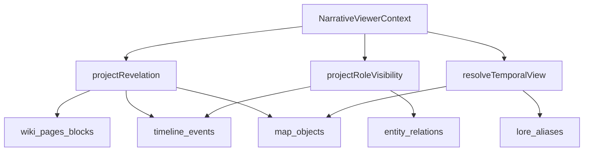

# Narrative projection semantics

**Layer:** 1 — Canon & Temporal Infrastructure (convergence)  
**Status:** Implemented  
**Roadmap:** [todo.md](../../todo.md) — Unified narrative projection semantics

## Purpose

Layer 1A shipped mature **per-domain** projection (chronology, maps, revelation, lore, wiki, entity graphs). This document defines the **shared semantics layer** so temporal, revelation, role visibility, and perspective do not drift across surfaces.

The goal is not perfect historical simulation on every surface—it is **intentional, documented asymmetry** with a single code path for each axis.

## Canonical module

[`shared/narrativeProjection.ts`](../../shared/narrativeProjection.ts)

| Primitive | Role |
|-----------|------|
| `NarrativeViewerContext` | Campaign-scoped viewer: perspective, role, capabilities, `campaignNow` |
| `projectRevelation` | Fog / `ContentPresenceState` (wraps Phase 23 `isEntityDiscovered`) |
| `projectPageNarrativeStatus` | GM editorial entity status (`PageNarrativeStatusType`) — distinct from fog and party epistemic discovery; module [`shared/pageNarrativeStatus.ts`](../../shared/pageNarrativeStatus.ts) |
| `projectNarrativeLifecycle` | Layer 2 quest/thread orchestration visibility — see [narrative-lifecycle.md](./narrative-lifecycle.md) |
| `projectRoleVisibility` | Role tier (PUBLIC / PARTY / ELEVATED_ONLY / SECRET) — not fog |
| `resolveTemporalView` | Surface-specific temporal policy |
| Domain adapters | `projectWikiPageVisibility`, `projectTimelineEventVisibility`, `projectMapSceneContext`, `projectLoreAtDate`, `projectEntityRelation` |

Backend factory: [`backend/src/lib/narrativeProjectionContext.ts`](../../backend/src/lib/narrativeProjectionContext.ts)

Frontend hook: [`frontend/src/hooks/useNarrativeViewerContext.ts`](../../frontend/src/hooks/useNarrativeViewerContext.ts)

## Composition

**Phase 23 discovery** ([phase-23-discovery-knowledge.md](../plans/phase-23-discovery-knowledge.md)) is the **revelation + epistemic** slice of this contract—`shared/discoveryProjection.ts` remains the browse/party-knowledge shapes; do not re-implement `HIDDEN` checks in controllers.

**Map presence** ([map-presence-visibility.md](../plans/map-presence-visibility.md)) is the **map scene** slice—`resolveMapObjectPresenceDetailed` still runs the full layer/revelation/temporal pipeline; `projectMapSceneContext` supplies `PresenceContext` and temporal resolution.

## Temporal policy (intentional asymmetry)

| Surface | Mode | Party | Elevated |
|---------|------|-------|----------|
| `map_scene` | `epoch_view` | Clamp `viewEpochMinute` to campaign now | Any requested epoch |
| `lore_summary` | `date_parts_view` | Accept `viewDate` (no clamp) | Same |
| `chronology_timeline` | `present_only` | No viewer-date slice | Same |
| `entity_graph` | `present_only` | Client uses `campaignNow` only | Same |
| `session_chronicle` | `present_only` | OOC sequence; optional `fantasyEpochMinute` in metadata | Same |

Call `resolveTemporalView` before domain resolvers on any surface that accepts historical input.

**Convergence roadmap:** [Cross-domain chronology convergence layer](../../todo.md) will add a unified overlay API; the policy table remains the contract for which surfaces honor party historical input.

## Visibility vocabulary adapters

Storage enums are **not** unified pre-1.0. Use adapters only:

| Domain | Storage | Adapter |
|--------|---------|---------|
| Chronology | `PUBLIC` / `PARTY` / `DM_ONLY` | `fromChronologyVisibility` |
| Wiki / maps | `Public` / `Party` / `DM_Only` | `fromWikiMapVisibility` |
| Entity relations | `PUBLIC` / `PARTY` / `GM_ONLY` / `SECRET` | `fromRelationVisibility` |

Normalized tier: `PUBLIC` | `PARTY` | `ELEVATED_ONLY` | `SECRET`.

## Map object revelation merge order

1. `ContentPresenceState` for `map_object` (override)
2. Active keyframe `revelation`
3. `MapSceneObject.revelation` column

See `resolveMapObjectRevelationState` in shared module.

## Controller rule

Do **not** compare `ContentRevelationStates.HIDDEN` / `DRAFT` inline in controllers. Use `projectRevelation`, `projectWikiPageVisibility`, or `isPageVisibleToParty` (discovery service delegating to shared).

## Chronology convergence (implemented)

Canonical types and cross-domain overlay feed: [chronology-convergence.md](./chronology-convergence.md) — [`shared/chronologyTypes.ts`](../../shared/chronologyTypes.ts), [`shared/chronologyConvergence.ts`](../../shared/chronologyConvergence.ts), `GET .../chronology/overlay`.

## Write ACL vs read projection

**Campaign write permissions** (who may edit world state, settings, membership) are **not** defined here. They live in the campaign access policy layer:

- [campaign-access-model.md](./campaign-access-model.md) — `shared/campaignPolicy`, `Campaign.campaignOwnerUserId`, membership roles (`GAMEMASTER` / `WRITER` / …), `can(actor, capability)`
- **This document** — what authenticated members *see* after role tiers, revelation fog, and temporal policy

`NarrativeViewerCapabilities` (e.g. `canRevealContent`, `isElevatedWiki`) describe **projection behavior**, not the canonical capability registry. Elevated read tier aligns with `narrative.elevated_view` (gamemaster + writer).

## Related work

- Campaign access (write ACL) — [campaign-access-model.md](./campaign-access-model.md)
- Temporal snapshots — [temporal-snapshots.md](./temporal-snapshots.md) (since last visit, milestones, compare)

## Changelog

Document Layer 1 convergence entries in [changelog.md](../../changelog.md) when shipping user-visible behavior changes.
