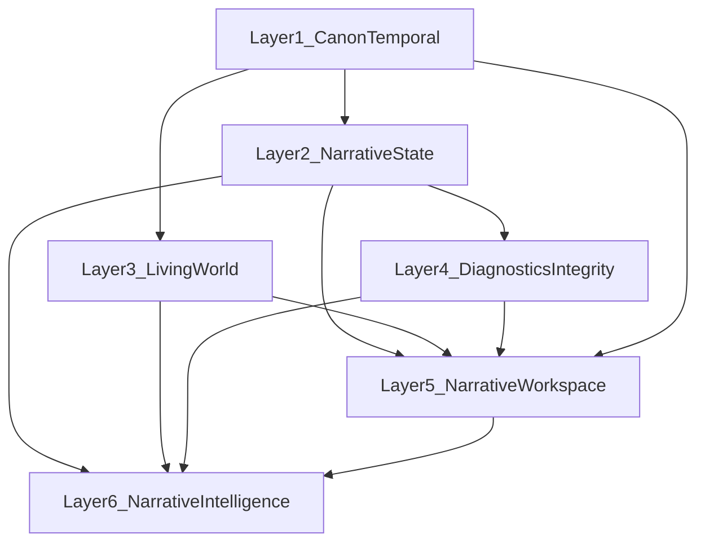

# Narrative Platform engine layers

**Status:** Implemented (2026-06-03)  
**Changelog:** [changelog.md](../../changelog.md) — domain-grouped release notes  
**Roadmap:** [todo.md](../../todo.md) — open work by layer

## Rationale

The domain restructure ([narrative-roadmap-restructure.md](./narrative-roadmap-restructure.md)) organized features by product area. This follow-up organizes the **Narrative Platform** by **engine dependency order** — what must mature before diagnostics, workspace UI, or intelligence generators can ship honestly.

Lower layers are schema and projection substrate; upper layers are orchestration surfaces and generators.

## Layer definitions

| Layer | Name | Role |
|-------|------|------|
| **1** | Canon & Temporal Infrastructure | **Shipped** — temporal runtime, projection convergence, snapshots, entity graph. See [changelog.md](../../changelog.md) |
| **2** | Narrative State Engine | **Shipped** — quest lifecycle, open threads, branching, consequences. See [changelog.md](../../changelog.md) |
| **3** | Living World Systems | **Shipped** — world advance, rumor engine, map overlays, creative drift. See [changelog.md](../../changelog.md) |
| **4** | Diagnostics & Integrity | **Shipped** — continuity v1 triad + structural diagnostics batch. See [changelog.md](../../changelog.md) |
| **5** | Narrative Workspace | **Partially shipped** — storyboard, investigation, timelines, relations; P3 editor + authoring workflow open in [todo.md](../../todo.md) |
| **6** | Narrative Intelligence | Open — prep, pacing, recap, spotlight in [todo.md](../../todo.md) |

## Pre-1.0 gate

**Narrative foundation (Layers 1–4):** Complete — see [changelog.md](../../changelog.md).

**Blocks v1.0.0 (open in [todo.md](../../todo.md)):**

- Schema freeze checklist (migration audit, extension-points doc)
- Infra baseline (Postgres default, Docker, CI)

Layers 5–6 default to post-freeze unless tagged `schema-sensitive`.

## Layer 1 projection semantics

Unified viewer context, revelation, role visibility, and temporal policy: [`docs/architecture-internal/narrative-projection-semantics.md`](../architecture-internal/narrative-projection-semantics.md) — [`shared/narrativeProjection.ts`](../../shared/narrativeProjection.ts).

## Shipped Layer 1 substrate (changelog only)

| Primitive | Changelog section |
|-----------|-------------------|
| Revelation projection | Narrative Platform — Knowledge & Revelation; Revelation & visibility |
| Event / temporal projection (maps) | Maps & spatial — temporal map projection |
| Relationship graph (base) | [0.7.0] — `WikiLink`, backlinks |
| Unified entity graph | `EntityRelation` table, sync service, local + diagnostics APIs — [entity-graph.md](../architecture-internal/entity-graph.md) |
| Chronology graph (partial) | [0.7.0] — fantasy calendars, chronology hub; Recruitment — chronicle canvas |

## Open item mapping checklist

| todo.md item | Layer | Primitive |
|--------------|-------|-----------|
| Unified narrative projection semantics | 1 | Projection convergence |
| Unified timeline overlay v1 (→ convergence layer) | 1 | Shipped — [chronology-convergence.md](../architecture-internal/chronology-convergence.md) |
| “Since last visit” diff v1 | 1 | Temporal snapshots |
| Campaign milestone snapshots | 1 | Temporal snapshots |
| Historical narrative diffing | 1 | Temporal snapshots |
| Unified entity relationship graph | 1 | Relationship graph — shipped |
| Graph query utilities | 1 | Relationship graph — shipped |
| Multi-calendar temporal mapping | 1 | Chronology graph (Campaign ops) |
| Chronology-appended wiki workflows | 1 | Event projection (Campaign ops) |
| Open narrative threads | 2 | Open threads |
| Quest state-machine skeleton | 2 | Quest lifecycle — shipped (see [narrative-lifecycle.md](../architecture-internal/narrative-lifecycle.md)) |
| Quest state-machine full | 2 | Quest lifecycle — shipped |
| Branching path & transition modeling | 2 | Branch state |
| Outcome & consequence engine | 2 | Consequence propagation |
| Quest publication pipeline | 2 | Revelation triggers |
| Published narrative projection system | 2 | Revelation triggers |
| Territorial borders by era | 3 | Region state |
| Advance world state | 3 | Faction / NPC / drift — [world-advance.md](../architecture-internal/world-advance.md) |
| Rumor engine | 3 | Faction progression — shipped [rumor-engine.md](../architecture-internal/rumor-engine.md) |
| Migration maps | 3 | NPC movement |
| Creative drift tracking | 3 | World drift — [creative-drift.md](../architecture-internal/creative-drift.md) |
| Weather / climate overlays | 3 | World drift |
| Travel routes, historical map states, vector masking | 3 | Geography overlays |
| Continuity warnings v1 | 4 | Continuity warnings |
| Dead-end, circular, hidden reachability | 4 | Diagnostics |
| Orphaned, clue redundancy, density, foreshadowing tracker | 4 | Orphan / structure analysis — **shipped** |
| Storyboard / scene / arc / beats / presets | 5 | Storyboard |
| Clue & lead dependency ledger | 5 | Investigation board |
| Scene timeline, story thread history view | 5 | Timeline orchestration |
| Heatmaps, org charts, family trees | 5 | Graph views |
| Creative workflow block | 5 | [Authoring workflow](./authoring-workflow.md) |
| Canonical page editor P0 (useBlockDraft, block actions, editorial expand) | 5 | Authoring workflow — UI substrate for Layer 4 block diagnostics |
| DM metadata, quest outliner, storyboard-as-view | 5 | Projection chrome |
| Session prep, pacing, recaps, journals, spotlight | 6 | Intelligence primitives |

## Metadata convention

- `layer:1` … `layer:6` — engine tier
- `depends:layer-N` — hard prerequisite
- Existing release tags unchanged (`gate:pre-1.0`, `schema-sensitive`, `ui-only`, `post-freeze-safe`, `legacy: Phase N`)

## Out of scope

- Restructuring [changelog.md](../../changelog.md) headings by layer (stays domain-grouped)
- Application code changes
