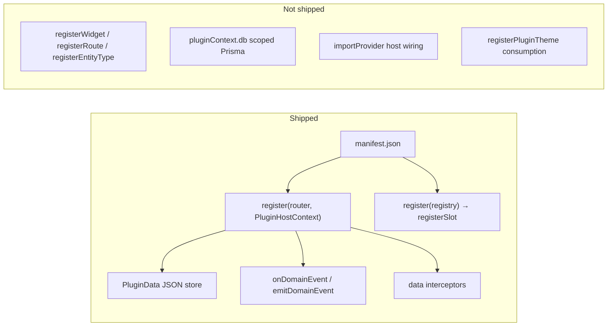

# Plugin capability matrix

**Author summary:** [docs/plugin-development/capabilities.md](../../../docs/plugin-development/capabilities.md)

**Last audited:** 2026-06-13  
**Scope:** What surfaces can plugins own today vs. stubbed, deferred, or intentionally rejected.

This document is the plugin half of the pre-1.0 extension-points gate. Lore/knowledge extension points live in [lore-knowledge-extension-points.md](../architecture-internal/lore-knowledge-extension-points.md).

Related docs: [phase-10-ecosystem.md](./phase-10-ecosystem.md), [security-model.md](./security-model.md), [plugin-tiers.md](../architecture-internal/plugin-tiers.md), [deferred-backlog.md](../deferred-backlog.md).

---

## Executive summary

Esiana ships a **manifest-driven, capability-constrained** plugin host — not a fluent `pluginApi` platform.

Plugins extend Esiana through:

- **`manifest.json`** — `permissions[]`, `uiSlots[]`, optional `configSchema`, `uninstallPolicy`
- **Backend** — `register(router, context)` on `PluginHostContext` (domain reads, `data` / `config` / `secrets`, assets, events, import/search registration)
- **Frontend** — `register(registry)` → slots, pages, sidebar items, dashboard widgets, `subscribeToDomainEvent`
- **Frontend RPC** — `context.api.get/post/put/delete/upload` → `/api/plugin-runtime/:pluginId/*` with campaign jail

There is no global `pluginApi`, raw `pluginContext.db`, `registerRoute` on core shells, or `registerEntityType`. The security model explicitly rejects arbitrary React roots and frontend `extendRoutes` — see [security-model.md](./security-model.md).

**Moon-tracker litmus test:** A moon plugin should need only `calendar.getCurrentDate()`, `events.subscribe`, `registerDashboardWidget`, `registerSidebarItem`, and `context.api.post` — not database access or custom entity tables.

**Can plugins extend Esiana?** Yes.

**Can plugins create first-class campaign subsystems at 1.0?** Yes for read/react/mutate/configure/deep-link flows. Entity overflow actions and plugin-to-plugin service registries remain post-1.0 — see [deferred-backlog.md](../deferred-backlog.md).

**Three storage concepts (never conflate):**

| Concept | API | Export |
|---------|-----|--------|
| Plugin runtime state | `context.data` | Included in backup |
| Campaign plugin settings | `context.config` | Included |
| Installation secrets | `context.secrets` | **Excluded** |

Plan snapshot: [pre-1.0-plugin-platform.md](../plans/pre-1.0-plugin-platform.md).

---

## Architecture at a glance

---

## Legend

| Status | Meaning |
|--------|---------|
| **Yes** | Wired and usable |
| **Partial** | API or slot exists but limited |
| **Stub** | Declared in manifest or code; not wired |
| **No** | Not available |
| **Rejected** | Intentional won't-do in the core plugin model |

---

## UI surfaces

| Surface | Status | What exists | Important nuance |
|---------|--------|-------------|------------------|
| **Campaign Home widgets** | Yes | `registerDashboardWidget` + `renderSettings`; persisted per-instance `widget.config` | Core `DashboardGrid` also renders plugin widgets (`plugin:pluginId:widgetId`) when placed in layout. |
| **Dashboard grid widgets** | Yes | `registerDashboardWidget` consumed by `DashboardGrid` | Plugin widgets join draggable grid with core widgets. |
| **Homepage (Global Hub)** | No | `GlobalHubPage` has no plugin slots | Product "homepage" = **Campaign Home** (`/campaigns/:handle/dashboard`), not the account hub. |
| **Sidebar navigation** | Yes | `registerSidebarItem({ section, pageId })` in IA buckets | Footer `sidebar` slot still available for lightweight chrome. |
| **Custom campaign pages / routes** | Partial | `/campaigns/:handle/plugin/:pluginId/:pageId/*` + `registerPage` | Core owns routing; plugins use `navigation.push({ subpath })` for in-page history. |
| **Wiki editor extensions** | Partial | `editor` slot on `WikiPage.tsx` | Zero community usage today. |
| **Map overlays** | Partial | `map:overlay`, `map:toolbar`, `map:token-context` declared | Slots exist; no community implementations. |
| **Campaign plugin settings** | Yes | `campaign-plugin-settings` slot | Used by wiki-opds-feed, player-journal. |
| **Header** | Yes | `header` slot in `HeaderAccountNav.tsx` | example-plugin only. |

### Declared UI slots

From `backend/src/lib/pluginManifest.ts` (`PluginUiSlots`):

| Slot id | Host surface |
|---------|--------------|
| `header` | App header (campaign shell) |
| `sidebar` | Campaign sidebar **footer** |
| `editor` | Wiki page editor extensions |
| `dashboard` | Campaign Home widgets |
| `map:overlay` | Map canvas overlay |
| `map:toolbar` | Map viewer toolbar |
| `map:token-context` | Pin context menus (reserved) |
| `campaign-plugin-settings` | Campaign Settings → Campaign Plugins configure panel |

---

## Data and platform APIs

| Surface | Status | What exists |
|---------|--------|-------------|
| **Plugin-owned campaign data** | Yes | `PluginDataService` — key/value JSON, campaign-jailed (`pluginDataService.ts`) |
| **Core entity read API** | Partial | `publicWiki.*` (public pages only); no general `getEntities()` |
| **Core entity write API** | Partial | Data interceptors suggest-only on `wikiPage` / `notebookArc`; plugins may call core REST directly (player-journal POSTs to `/api/campaigns/:slug/wiki`) — not a stable plugin contract |
| **Scoped Prisma (`pluginContext.db`)** | Stub | Documented target in [security-model.md](./security-model.md); **not on `PluginHostContext`** |
| **Entity type registration** | No | Entity page shells are core-internal (`entityPageShells/registry.ts`) |
| **Relationship type registration** | No | Fixed core relation model |
| **Entity field augmentation** | Partial | Interceptors can mutate `metadata` on wiki pages; `registerCustomField` unwired; `wiki:decorate` for read-path `pluginDisplay` |
| **Campaign settings extensions** | Partial | `configSchema` / `configTemplate` in manifest → auto-settings UI; no plugin-defined campaign-level settings panels beyond per-plugin config |
| **World state providers** | Yes | `developmentProvider` capability — settlement-life reference |
| **Search integration** | No | PluginData and plugin entities invisible to core search |
| **Timeline integration** | No | No plugin write API for timeline events |
| **Calendar integration** | Partial | Plugins can listen to `core:calendar:advanced` / `core:world:advanced`; no register-holiday API |
| **Codex / wiki blocks** | Partial | `wiki:decorate` injects metadata/display hints; no TipTap block registration from plugins |
| **Global wiki references** | No | Plugin entities cannot be linked from core wiki `[[...]]` resolution |
| **Notifications** | No | Hardcoded notification types; `NotificationChannel` registry deferred |

### PluginHostContext registration methods

Backend plugins receive `PluginHostContext` from `register(router, context)`:

| Method | Permission | Status |
|--------|------------|--------|
| `registerStorageProvider(id, factory)` | `storage:provider` | Yes |
| `createPluginDataService(campaignId?)` | `plugin:data` | Yes |
| `registerDataInterceptor(definition)` | `data:interceptor` | Yes |
| `onDomainEvent(pattern, listener)` | — | Yes |
| `emitDomainEvent(type, payload, campaignId?)` | — | Yes |
| `registerPublicRoutes(registerFn)` | `feed:public` | Yes |
| `registerWikiContentDecorator(fn)` | `wiki:decorate` | Yes |
| `registerDevelopmentProvider(provider)` | `world-development:provider` | Yes |
| `registerEligibilityProvider(provider)` | `world-development:provider` | Yes |
| `registerRationaleProvider(provider)` | `world-development:provider` | Yes |
| `registerDevelopmentResolveProvider(provider)` | `world-development:provider` | Yes |
| `publicWiki.*` | `wiki:read-public` | Yes |
| `feeds.buildOpdsAtom(feed)` | `feed:opds` | Yes |
| `isEnabledForCampaign(campaignId)` | — | Yes |
| `getCampaignConfig(campaignId)` | — | Yes |

Source: `backend/src/lib/plugins/pluginHostContext.ts`.

### Manifest capabilities

| Capability | Status | Notes |
|------------|--------|-------|
| `contentPack` | Yes | Manifest `contentPacks[]`; core `importContentPack()` |
| `developmentProvider` | Yes | World development candidate providers |
| `importProvider` | Stub | Declared in manifest; **no host wiring** |
| `campaignGenerator` | Retired | Legacy shim; superseded by content packs + Sample Data |

### Manifest permissions

From `backend/src/lib/pluginPermissions.ts`:

`storage:provider`, `plugin:data`, `data:interceptor`, `network:fetch`, `feed:public`, `wiki:read-public`, `feed:opds`, `ui:slot`, `wiki:decorate`, `campaign:seed`, `world-development:provider`

`network:fetch` and `ui:slot` are declarative (CSP / slot gating). `campaign:seed` is an API bearer scope, not a host registration hook.

### Data interceptors (wired entities)

| Entity | Phases |
|--------|--------|
| `wikiPage` | `beforeCreate`, `beforeUpdate` |
| `notebookArc` | `beforeCreate` |

Field allowlists in `backend/src/lib/pluginRuntime/interceptorAllowlist.ts`. Fail-open default; quarantine after repeated failures.

### Core domain events

From `backend/src/lib/domainEvents/types.ts`:

- `core:wiki:created`, `core:wiki:updated`, `core:wiki:deleted`
- `core:notebook_arc:created`, `core:notebook_arc:updated`, `core:notebook_arc:deleted`
- `core:calendar:advanced`, `core:world:advanced`
- `core:campaign:created`

Plugins emit `{pluginId}:` prefixed types only. Events are observational — no ordering, retries, or persistence guarantees. See [domain-events.md](./domain-events.md).

---

## Import, export, and integrations

| Surface | Status | What exists |
|---------|--------|-------------|
| **Content pack import** | Yes | `contentPack` capability + Create Campaign wizard; demo-content-packs |
| **Wizard importers (Notion/Kanka/OneNote)** | Stub | `importProvider` in manifest — no host wiring; deferred plugin-only |
| **Markdown ZIP / backup import** | Yes | Core wizard paths (Obsidian-style, esiana-backup) — not plugin-extensible |
| **Plugin exporters** | No | Core campaign backup/markdown export only |
| **External integrations (generic)** | Partial | Pattern: backend routes + `network:fetch` CSP + PluginData; no `ExternalSystemProvider` abstraction |
| **Foundry VTT** | Stub | foundry-vtt-sync returns `{ status: 'stub' }` |
| **Roll20** | Stub | Registry browse-only entry, no code |
| **Kanka** | No | Deferred plugin-only wizard ingest |
| **Obsidian** | Partial | Markdown ZIP import (core); bidirectional sync API open |
| **OPDS / e-readers** | Yes | wiki-opds-feed — working third-party-facing integration |

Integration pattern for external systems: backend plugin routes at `/api/plugin-runtime/:pluginId/*`, optional `network:fetch` for outbound HTTP, state in `PluginData`. The host does not know Foundry, Roll20, or Kanka by name.

---

## Lifecycle and infrastructure

| Surface | Status | Notes |
|---------|--------|-------|
| **Domain event listeners** | Yes | `onDomainEvent` with wildcards |
| **Domain event emit** | Yes | `{pluginId}:` prefix enforced |
| **Background / scheduled jobs** | No | No plugin scheduler; plugins react to world advance events only |
| **Data interceptors** | Partial | Sandbox workers; wikiPage + notebookArc only |
| **Storage providers** | Yes | `remote-object-storage` community plugin (`storageProvider` capability) |
| **Themes** | Stub | `registerPluginTheme` unwired; campaign theme engine is core todo (Phase 15) |
| **Campaign creation** | Partial | Content packs in wizard; `campaign:seed` bearer scope for seeder CLI |
| **PDK / SDK package** | No | Phase 13 todo; types duplicated across backend/frontend |

---

## Terminology map

Common assumptions vs. Esiana reality:

| Common assumption | Esiana reality |
|-------------------|----------------|
| `registerHomeWidget()` | `registry.registerSlot('dashboard', { render })` + manifest `uiSlots: ['dashboard']` |
| `registerSidebar()` | Same slot API; mounts **footer**, not nav tree |
| `registerRoute('/ships')` | Rejected — `/api/plugin-runtime/:id/...` + in-slot UI |
| `registerImporter()` | Use `contentPack` today; `importProvider` unwired |
| `pluginApi.getEntities()` | Does not exist; nearest: `publicWiki.*` or direct REST |
| Add themes via plugin | API stub only; core Phase 15 campaign theme engine separate |
| Homepage widgets | Campaign Home slot only; Global Hub has no extension point |
| Dashboard widget in grid | Core enum only; plugin slot is a separate panel above the grid |

---

## Community plugin evidence

Audited against `community-plugins/` on 2026-06-13.

### Registry catalog (installable via Sync Registry)

| Plugin | Scope | Capabilities used | UI slots used | Host APIs used |
|--------|-------|-------------------|---------------|----------------|
| **demo-content-packs** | global | `contentPack` | — | manifest-only import |
| **wiki-opds-feed** | campaign | — | `campaign-plugin-settings` | public routes, `publicWiki`, OPDS |
| **remote-object-storage** | global | `storageProvider` | — | storage driver registration |

### Examples (`community-plugins/examples/` — not registry-listed)

| Plugin | Scope | Capabilities used | UI slots used | Host APIs used |
|--------|-------|-------------------|---------------|----------------|
| **example-plugin** | global | — | `sidebar`, `header` | routes, data interceptor |
| **player-journal** | campaign | — | `dashboard`, `campaign-plugin-settings` | routes, PluginData, domain emit, wiki POST |
| **settlement-life** | global | `developmentProvider` | — | dev providers, PluginData |

### Stubs (`community-plugins/stubs/` — not registry-listed)

| Plugin | Scope | Capabilities used | UI slots used | Host APIs used |
|--------|-------|-------------------|---------------|----------------|
| **foundry-vtt-sync** | global | — | — | stub route |

**Retired:** `campaign-seeder` — engine superseded by core Sample Data; package removed from community-plugins.

### Extension points with zero community usage

- `editor` UI slot
- `map:overlay`, `map:toolbar`, `map:token-context`
- `importProvider` capability
- `storage:provider` — used by `remote-object-storage` (bundled infra plugin)
- `wiki:decorate` permission
- `onDomainEvent` subscription (emit only in player-journal)

### Registry stubs (browse-only, no code)

aurora-theme, initiative-widget, discord-lfg-bridge, roll20-sync

### Production-quality patterns proven in practice

1. **Content packs** — demo-content-packs (manifest-driven lore import)
2. **World development** — settlement-life (developmentProvider)
3. **Campaign widgets + PluginData** — player-journal (dashboard slot)
4. **Public syndication** — wiki-opds-feed (OPDS + publicWiki API)

---

## Platform threshold assessment

### What plugins can do today

- Own backend logic + JSON state (`PluginData`)
- Render a Campaign Home panel (`dashboard` slot)
- Hook world development (`developmentProvider`)
- Seed/import lore (`contentPack`)
- Expose public feeds (OPDS)
- Suggest wiki mutations (interceptors)
- Decorate wiki read responses (`wiki:decorate`)
- Subscribe to / emit domain events

### What plugins cannot do today

- Own a sidebar nav destination or first-class route in the app shell
- Register draggable dashboard grid widgets
- Define searchable entity types (Ship, Kingdom, Moon phase as first-class lore)
- Participate in timeline, calendar authoring, or wiki link graph natively
- Rely on a stable read/write entity API (must call core REST or store opaque JSON)

**Platform threshold not yet met:** someone cannot build ships/kingdoms/moons as native campaign subsystems without core REST workarounds or invisible PluginData islands.

### Future-VTT stress test

Combat tracker / initiative / character sheet as plugin is **philosophically allowed** (plugin-only in [deferred-backlog.md](../deferred-backlog.md)) but **technically blocked** by missing full-page routes, entity registration, and grid widget integration — not by an explicit API ban.

Esiana core stays narrative infrastructure; plugins may go wild within slot and route constraints.

---

## Pre-1.0 gap recommendations

### Tier A — Document-only (this audit)

Ship this capability matrix and link from phase-10 docs. Satisfies the plugin portion of the todo.md extension-points gate without code or schema changes.

### Tier B — High ceiling, post-freeze-safe

Recommended before or immediately after schema freeze. Raises the "first-class subsystem" ceiling **without new core entity tables**:

1. **Stable plugin data access API** — Wire documented `pluginContext.db` via `getCampaignPrisma` **or** ship a curated read API (`getWikiPages`, `getOrganizations`, `getCalendar`, `getCampaignSummary`) on `PluginHostContext`. **Single most important pre-1.0 plugin decision.**

2. **Wire `importProvider`** — Host hook for wizard ingest backends (Kanka, Notion, OneNote deferred as plugin-only). Manifest capability already exists; implementation is orchestration only.

3. **Consume presentation registry** — Wire `listLayoutWidgets('dashboard')` into `DashboardGrid` so plugins can register grid widgets (extends fixed enum without schema change).

4. **Sidebar nav registration (new slot or API)** — Distinct from footer `sidebar` slot: allow plugins to declare nav entries with icons + in-app panel targets. UI-only; high platform signal.

### Tier C — Significant platform work (post-1.0 unless explicitly prioritized)

- Plugin search indexing (PluginData + plugin entity descriptors)
- Timeline/calendar write hooks
- Wiki `[[link]]` resolution for plugin entity IDs
- `registerEntityType` / plugin codex blocks
- Notification type registration
- PDK npm package (`@esiana/plugin-sdk`)
- Generic `ExternalSystemProvider` abstraction over Foundry/Roll20/Kanka adapters

### Tier D — Intentionally defer (align with product identity)

- Frontend `extendRoutes` / full app route ownership
- Combat/VTT features in core (stay plugin-only stubs)
- Real-time WebSocket bridges
- Plugin-defined core entity tables (violates post-freeze schema policy in [todo.md](../../todo.md))

---

## Stress-test scenarios

| Scenario | Pass today? | Blocker |
|----------|-------------|---------|
| Moon phase tracker on Campaign Home | Yes | `dashboard` slot + PluginData |
| Ships subsystem with sidebar nav | No | Nav tree + routes + entity API |
| Kingdom treasury widget in grid | No | Grid widget registry unwired |
| Foundry journal sync | No | Stub only; no provider abstraction |
| Kanka import in wizard | No | `importProvider` unwired |
| Stress/sanity on character pages | Partial | `metadata` via interceptors; no custom fields UI |
| Combat tracker plugin | Partial | Allowed philosophically; needs full-page UI pattern |
| Plugin content in search | No | No indexing pipeline |
| Faction tension world provider | Yes | `developmentProvider` pattern (settlement-life) |
| Player journal publish-to-wiki | Yes | PluginData + dashboard slot + core wiki POST |
| E-reader OPDS catalog | Yes | wiki-opds-feed + publicWiki API |

---

## Audit methodology

1. **Manifest contract** — `backend/src/lib/pluginManifest.ts`, `backend/src/lib/pluginPermissions.ts`
2. **Host API surface** — `backend/src/lib/plugins/pluginHostContext.ts`
3. **Frontend slot hosts** — grep `PluginSlotHost` in `frontend/src/`
4. **Stub detection** — registry functions with zero consumers (`listPluginThemes`, `listLayoutWidgets`, `IMPORT_PROVIDER`)
5. **Community proof** — `community-plugins/` manifests + runtime usage
6. **Deferred ledger cross-check** — `docs/deferred-backlog.md` plugin-only / open items

---

## Source file index

| Purpose | Path |
|---------|------|
| Manifest + capabilities | `backend/src/lib/pluginManifest.ts` |
| Permissions registry | `backend/src/lib/pluginPermissions.ts` |
| Host context API | `backend/src/lib/plugins/pluginHostContext.ts` |
| PluginData store | `backend/src/lib/plugins/pluginDataService.ts` |
| Data interceptors | `backend/src/lib/pluginRuntime/` |
| Domain events | `backend/src/lib/domainEvents/` |
| Frontend slots | `frontend/src/plugins/slots/` |
| Presentation registry (unwired) | `frontend/src/lib/pluginPresentation.ts` |
| Entity page shells (core-only) | `frontend/src/lib/entityPageShells/registry.ts` |
| Ecosystem docs | `docs/plugins/phase-10-ecosystem.md` |
| Security model | `docs/plugins/security-model.md` |
| Reference plugin | `community-plugins/examples/example-plugin/` |
| Deferred work | `docs/deferred-backlog.md`, `todo.md` |
