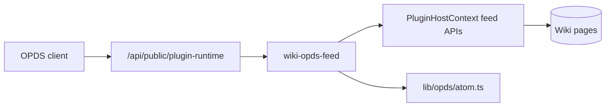

# OPDS wiki feed study (Phase 10E)

This document records the spike for syndicating **public** campaign wiki lore to e-readers via [OPDS 1.2](https://specs.opds.io/opds-1.2) Atom catalogs. Implementation lives in the campaign-scoped reference plugin [`community-plugins/wiki-opds-feed/`](../../../community-plugins/wiki-opds-feed/). Core provides only a generic Atom XML builder and permission-gated read APIs on `PluginHostContext`.

## Goals

- Read-only syndication — no writes, no domain events required for v1.
- Respect wiki visibility — **only `Public` pages**; never Party or DM_Only.
- Campaign gate — only campaigns with **`isPublicViewable`** expose a feed.
- Per-campaign enablement — **`CampaignPluginSetting.isEnabled`** (no env flag, no global admin toggle).
- Plugin model — routes register via **`feed:public`** permission on a public plugin host (no auth).

## Non-goals (v1)

- EPUB/PDF generation (acquisitions ship as `text/markdown`).
- Authenticated OPDS for Party-visible lore (future: bearer token or HTTP Basic).
- Real-time invalidation via `dispatchDomainEvent` (catalog uses 5-minute cache).
- Full Calibre/KOReader QA matrix.

## Visibility mapping

| Wiki visibility | In OPDS feed? | Rationale |
|-----------------|---------------|-----------|
| `Public` | Yes | Intended for anonymous/public discovery |
| `Party` | No | Requires campaign membership |
| `DM_Only` | No | DM secrets |

Additional exclusions:

- `templateType === SESSION_NOTE'` — session notes are never syndicated.
- Non-text blocks serialize as fenced `esiana/block` JSON in markdown exports (same as campaign backup).

This aligns with [`canViewWikiPage`](../../backend/src/lib/wikiTree.ts): anonymous/`null` role may only see `Public`.

## OPDS 1.2 Atom mapping

### Catalog feed

- **URL:** `/api/public/plugin-runtime/wiki-opds-feed/c/{campaignSlug}/opds/catalog.atom`
- **Content-Type:** `application/atom+xml; charset=utf-8`
- **Profile:** `opds-catalog` (self link type)

| Atom element | Esiana source |
|--------------|---------------|
| `feed/title` | `{campaign.name} — {catalogTitleSuffix}` (configurable per campaign, default "Public Lore") |
| `feed/id` | `urn:esiana:campaign:{slug}:opds:catalog` |
| `feed/updated` | Max wiki page `updatedAt` or campaign `updatedAt` |
| `entry/title` | Wiki page title |
| `entry/id` | `urn:esiana:campaign:{slug}:wiki:{pageId}` |
| `entry/updated` | Page `updatedAt` (ISO 8601) |
| `entry/summary` | Plain-text snippet from blocks |
| `entry/link[@rel=acquisition]` | Markdown acquisition URL |
| `entry/link[@type]` | `text/markdown` |

### Acquisition

- **URL:** `/api/public/plugin-runtime/wiki-opds-feed/c/{campaignSlug}/opds/pages/{pageId}.md`
- **Content-Type:** `text/markdown; charset=utf-8`
- Body produced via host `wikiPageToMarkdown` API (wraps [`wikiPageToMarkdown`](../../backend/src/lib/campaignExport/wikiPageToMarkdown.ts)).

## Architecture



1. Plugin calls `context.registerPublicRoutes()` (requires `feed:public`).
2. Host mounts unauthenticated routers at `/api/public/plugin-runtime/{pluginId}/`.
3. Plugin handlers gate on `context.isEnabledForCampaign()` and call host read APIs — no wiki-specific logic in core.

## Enable checklist

```text
Campaign Settings → Campaign Plugins → Install Wiki OPDS Feed → Enable → Save
Campaign settings → Public viewable = on
Wiki pages → visibility = Public
```

The OPDS catalog URL is shown in Campaign Settings when the plugin is enabled.

## Security notes

- **Fail closed:** disabled plugin for campaign or non-public-viewable campaign → **404**.
- **No campaign jail bypass:** host APIs filter `visibility = Public` in SQL.
- **Rate limiting:** public routes inherit global Express stack; consider dedicated limiter if abused (Phase 10.5 hardening).
- **Asset URLs in markdown:** v1 does not rewrite uploaded assets to signed URLs; e-readers may not resolve `/api/assets/...` offline.

## Future work

| Item | Notes |
|------|-------|
| EPUB acquisitions | Pandoc pipeline or pre-generated files in storage registry |
| Party OPDS | Session or scoped bearer token; separate catalog profile |
| `core:wiki:updated` cache bust | Optional subscriber to bump `feed/updated` eagerly |
| OPDS 2.0 / JSON feeds | Evaluate client support before dual emission |

## References

- [OPDS 1.2 specification](https://specs.opds.io/opds-1.2)
- [Phase 10 ecosystem overview](./phase-10-ecosystem.md#part-10e--opds-wiki-feed-study-implemented)
